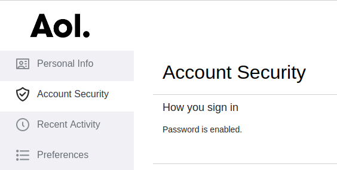
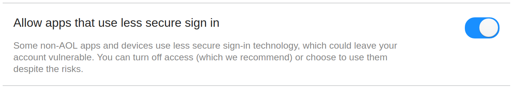

<!-- This document must be rendered in RStudio using the option "knitr with parameters" or rmarkdown::render("MyDocument.Rmd", params = list(password = "my_password"))-->

<!-- README.md is generated from README.Rmd. Please edit .Rmd file -->

```{r, echo = FALSE}
knitr::opts_chunk$set(
  collapse = TRUE,
  comment = "#>",
  fig.path = "README-"
)
```

# mRpostman 

<!-- # mRpostman  -->
<!-- [](http://www.r-pkg.org/pkg/mRpostman) -->
<!-- one space after links to display badges side by side -->

[](https://travis-ci.org/allanvc/mRpostman) 
[](https://cran.r-project.org/package=mRpostman) 
[](https://cran.r-project.org/package=mRpostman) 
[](https://opensource.org/licenses/GPL-3.0) 

IMAP Tools for R in a Tidy Way


## Overview

**mRpostman** provides multiple IMAP (Internet Message Access Protocol) commands 
based on the RFC 3501 manual (Crispin, 2003), its updates, 
and other related documents.

mRpostman website: https://allanvc.github.io/mRpostman

## First things first ...

Before using **mRpostman**, it is essential to configure your mail account. Many 
mail providers require authorizing **"less secure apps"** to access your account 
from a third part app.

See how to do it for Gmail, Yahoo Mail and AOL Mail.

### Gmail

1) Go to Gmail website and log in with your credentials.

2) Then, go to https://myaccount.google.com/u/1/lesssecureapps?pageId=none


3) Set "Allow less secure apps" to **ON**.


### Yahoo Mail

1) Go to Yahoo Mail website and log in with your credentials.

2) Click on "Account Info".


3) Click on "Account Security" on the left menu. 


4) After, set "Allow apps that use less secure sign in" **ON**


### AOL Mail

1) Go to AOL Mail website and log in with your credentials.

2) Click on "Options" and then on "Account Info".


3) Click on "Account Security" on the left menu. 



4) After, set "Allow apps that use less secure sign in" **ON**




## Introduction

The package is divided in 6 groups of functions:

* **configuration**: `configureIMAP()`;
* **mailboxes commands**: `listMailboxes()`, `selectMailbox()`, `examineMailbox()`,
`renameMailbox();`
* **options listing**: `listServerCapabilities()`,`flag_options()`, 
`section_or_field_options()`, `metadata_options()`;
* **search**: `searchBefore()`, `searchSince()`, `searchPeriod()`, `searchOn()`, 
`searchSentBefore()`,`searchSentSince()`, `searchSentPeriod()`, `searchSentOn()`,
`searchString()`, `searchFlag()`, `searchSmallerThan()`, `searchLargerThan()`,
`searchYoungerThan()`, `searchOlderThan()`, `customSearch()`;
* **fetch**: `fetchFullMsg()`, `fetchMsgHeader()`, `fetchMsgText()`, 
`fetchMsgMetadata()`;
* **miscellania**: `copyMsg()`, `getMinId()`, `getMaxId()`, `deleteMsg()`, 
`expunge()`, `addFlags()`, `removeFlags()`, `replaceFlags()`, `moveMsg()`.


## Installation

```{r, eval = FALSE}
# CRAN version
install.packages("mRpostman")

# Dev version
if (!require('devtools')) install.packages('devtools')
devtools::install_github("allanvc/mRpostman")
```


## Basic Usage

### 1) Configuring IMAP and listing mailboxes

```{r, message = FALSE, eval=FALSE}

library(mRpostman)

# IMAP settings
# Gmail
imapconf <- configureIMAP(url="imaps://imap.gmail.com",
                          username="your_user",
                          password=rstudioapi::askForPassword()
                          )

# Yahoo Mail
# imapconf <- configureIMAP(url="imaps://export.imap.aol.com/",
#                           username="your_user",
#                           password=rstudioapi::askForPassword()
#                           )

# AOL Mail
# imapconf <- configureIMAP(url="imaps://export.imap.aol.com/",
#                           username="your_user",
#                           password=rstudioapi::askForPassword()
#                           )

# you can try another IMAP server

# Listing
imapconf %>%
  listMailboxes()
```

### 2) Examining a Mailbox

```{r, message = FALSE, eval=FALSE}

# examine mailbox -- number of existent and recent messages
imapconf %>%
  selectMailbox(mbox = "UC Riverside") %>% # mbox names are case sensitive
  examineMailbox()

```

### 3) Searching by period using a flag

```{r, message = FALSE, eval=FALSE}

# search
results <- imapconf %>%
  selectMailbox(mbox = "INBOX") %>%
  searchPeriod(since_date_char = "17-May-2018",
               before_date_char = "30-Jun-2019",
               flag = "ANSWERED")

results$msg_id
```

### 4) Searching for a string in the "Text" section of messages

```{r, message = FALSE, eval=FALSE}

# search
results <- imapconf %>%
  selectMailbox(mbox = "UC Riverside") %>%
  searchString(section_or_field = "TEXT", string = "Welcome!")

results$msg_id
```

### 5) Fetch headers after searching

```{r, message = FALSE, eval=FALSE}

results <- imapconf %>%
  selectMailbox(mbox = "UC Riverside") %>%
  searchString(section_or_field = "TEXT", string = "Welcome!") %$% # exposition pipe, not %>%!!
  fetchMsgHeader(imapconf = imapconf, msg_id = msg_id, 
                 fields = c("DATE", "SUBJECT"))

results
```


## License

This package is licensed under the terms of the GPL-3 License.


## References

Crispin, M., *INTERNET MESSAGE ACCESS PROTOCOL - VERSION 4rev1*, RFC 3501, DOI: 10.17487/RFC3501, March 2003, https://www.rfc-editor.org/info/rfc3501.

Ooms, J. curl: *A Modern and Flexible Web Client for R*. R package version 3.3, 2019, https://CRAN.R-project.org/package=curl

Stenberg, D. *Libcurl - The Multiprotocol File Transfer Library*, https://curl.haxx.se/libcurl/
