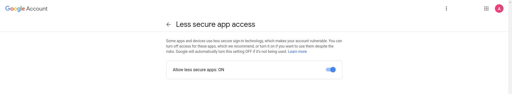

<!-- This document must be rendered in RStudio using the option "knitr with parameters" or rmarkdown::render("MyDocument.Rmd", params = list(password = "my_password"))-->

<!-- README.md is generated from README.Rmd. Please edit .Rmd file -->

# mRpostman 

<!-- # mRpostman  -->

<!-- [](http://www.r-pkg.org/pkg/mRpostman) -->

<!-- one space after links to display badges side by side -->

[](https://travis-ci.org/allanvc/mRpostman)
[](https://cran.r-project.org/package=mRpostman)
[](https://cran.r-project.org/package=mRpostman)
[](https://opensource.org/licenses/GPL-3.0)

## Overview

**mRpostman** provides multiple IMAP (Internet Message Access Protocol)
commands, such as listing mailboxes, searching and fetching messages by
several criteria based on the RFC 3501 manual (Crispin, 2003, ), its
updates, and other related manuals.

## First things first …

Before using **mRpostman**, it is essential to configure your mail
account. Many mail providers today require authorizing **“less secure
apps”** to access your account from a third part app.

See how to do it for GMail, Yahoo Mail and AOL Mail.

### GMail

1)  Go to GMail website and logon with your credentials.

2)  Then, go to
    <https://myaccount.google.com/u/1/lesssecureapps?pageId=none>



3)  Set “Allow less secure apps” to **ON**.

### Yahoo Mail

1)  Go to Yahoo Mail website and logon with your credentials.

2)  Click on “Account Info”.


3)  Click on “Account Security” on the left menu.


4)  After, set “Allow apps that use less secure sign in” **ON**

### AOL Mail

1)  Go to AOL Mail website and logon with your credentials.

2)  Click on “Options” and then on “Account Info”.


3)  Click on “Account Security” on the left menu.


4)  After, set “Allow apps that use less secure sign in” **ON**

## Introduction

The package is divided in 6 groups of functions:

  - **configuration**: `configureIMAP()`;
  - **mailboxes commands**: `listMailboxes()`, `selectMailbox()`,
    `examineMailbox()`, `renameMailbox();`
  - **options listing**: `listServerCapabilities()`,`flag_options`,
    `section_or_field_options()`, `metadata_options()`;
  - **search**: `searchBefore()`, `searchSince()`, `searchPeriod()`,
    `searchOn()`, `searchSentBefore()`,`searchSentSince()`,
    `searchSentPeriod()`, `searchSentOn()`, `searchString()`,
    `searchFlag()`, `searchSmallerThan()`, `searchLargerThan()`,
    `searchYoungerThan()`, `searchOlderThan()`, `customSearch()`;
  - **fetch**: `fetchFullMsg()`, `fetchMsgHeader()`, `fetchMsgText()`,
    `fetchMsgMetadata()`;
  - **miscellania**: `copyMsg()`, `getMinId()`, `getMaxId()`,
    `deleteMsg()`, `expunge()`, `addFlags()`, `removeFlags()`,
    `replaceFlags()`, `moveMsg()`.

## Installation

``` r
# CRAN version
install.packages("mRpostman")

# Dev version
if (!require('devtools')) install.packages('devtools')
devtools::install_github("allanvc/mRpostman")
```

## Basic Usage

### 1\) Configuring IMAP and listing a mailboxes

``` r

library(mRpostman)

# IMAP settings
imapconf <- configureIMAP(url="imaps://imap.gmail.com",
                          username="your_user",
                          password = password=rstudioapi::askForPassword()
                          )

# Listing
imapconf %>%
  listMailboxes()
```

### 2\) Examining a Mailbox

``` r

# examine mailbox -- number of existent and recent messages
imapconf %>%
  selectMailbox(mbox = "UC Riverside") %>% # be careful - case sensitive
  examineMailbox()
```

### 3\) Search By Period using a flag

``` r

# search
results <- imapconf %>%
  selectMailbox(mbox = "INBOX") %>%
  searchPeriod(since_date_char = "17-May-2018",
               before_date_char = "30-Jun-2019",
               flag = "ANSWERED")

results$msg_id
```

### 4\) Search for a String in messages’ TEXT section

``` r

# search
results <- imapconf %>%
  selectMailbox(mbox = "UC Riverside") %>%
  searchString(section_or_field = "TEXT", string = "Welcome!")

results$msg_id
```

### 5\) Fetch Headers after a search

``` r

results <- imapconf %>%
  selectMailbox(mbox = "UC Riverside") %>%
  searchString(section_or_field = "TEXT", string = "Welcome!") %$% # be careful - exposition pipe, not %>%!!
  fetchMsgHeader(imapconf = imapconf, msg_id = msg_id, 
                 fields = c("DATE", "SUBJECT"))

results
```

## License

This package is licensed under the terms of the GPL-3 License.

## References

Crispin, M., *“INTERNET MESSAGE ACCESS PROTOCOL - VERSION 4rev1”*, RFC
3501, <doi:10.17487/RFC3501>, March 2003,
<https://www.rfc-editor.org/info/rfc3501>.
