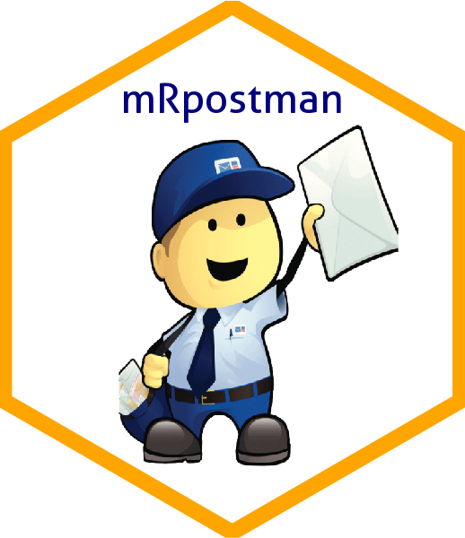

<!-- # mRpostman -->

# mRpostman 

<!-- # mRpostman  -->
<!-- [](http://www.r-pkg.org/pkg/mRpostman) -->
<!-- one space after links to display badges side by side -->
<!-- [](https://travis-ci.org/allanvc/mRpostman)  -->
<!-- badges: start -->

[](https://cran.r-project.org/package=mRpostman)
[](https://cran.r-project.org/package=mRpostman)
[](https://opensource.org/license/gpl-3-0)
[](https://github.com/allanvc/mRpostman/actions/workflows/R-CMD-check.yaml)
<!-- [](https://app.codecov.io/gh/allanvc/mRpostman?branch=master) -->
<!-- badges: end -->

An IMAP Client for R

## Overview

`mRpostman` is an easy-to-use IMAP client that provides tools for
message searching, selective fetching of message attributes, mailbox
management, attachment extraction, and several other IMAP features. The
aim of this package is to pave the way for email data analysis in R. To
do so, `mRpostman` makes extensive use of the {curl} package and the
libcurl C library.

`mRpostman`’s official website: <https://allanvc.github.io/mRpostman/>

Cite `mRpostman`: A. V. C. Quadros, “mRpostman: An IMAP Client for R”,
Journal of Open Research Software, vol. 12, no. 1, p. 4, 2024, doi:
10.5334/jors.480. [http](https://doi.org/10.5334/jors.480). Refer to
`citation("mRpostman")`.

**IMPORTANT**:

1.  In version `0.9.0.0`, `mRpostman` went trough substantial changes,
    including ones that have no backward compatibility with versions
    `<= 0.3.1`. A detailed vignette on how to migrate your mRpostman’s
    deprecated code to the new syntax is available at [*“Migrating old
    code to the new mRpostman’s
    syntax”*](https://allanvc.github.io/mRpostman/articles/code_migration.html).

2.  Old versions of the libcurl C library ({curl}’s main engine) will
    cause the malfunction of this package. If your libcurl’s version is
    above 7.58.0, you should be fine. In case you intend to use OAuth
    2.0 authentication, then you will need libcurl \>= 7.65.0. To learn
    more about the OAuth 2.0 authentication in this package, refer to
    the [*“Using IMAP OAuth2.0 authentication in
    mRpostman”*](https://allanvc.github.io/mRpostman/articles/xoauth2.0.html)
    vignette.

3.  Most mail providers discontinued less secure apps access. If it is
    still available and you are comfortable with this type of access you
    can enable this option for your account on your mail provider. Some
    providers, such as Yahoo Mail, also offer the option to generate
    password to be used by third-party apps such as mRpostman. The other
    option, as mentioned above, is to set up OAuth2 (two-factor
    authentication) in order to access your mailbox. Please also refer
    to the [*“Using IMAP OAuth2.0 authentication in
    mRpostman”*](https://allanvc.github.io/mRpostman/articles/xoauth2.0.html)
    vignette.

## Providers and their IMAP urls

| **Provider**                       | **IMAP Server**           |
|------------------------------------|---------------------------|
| Gmail                              | `imap.gmail.com`          |
| Office 365                         | `outlook.office365.com`\* |
| Outlook.com (Hotmail and Live.com) | `imap-mail.outlook.com`   |
| Yahoo Mail                         | `imap.mail.yahoo.com`     |
| iCloud Mail                        | `imap.mail.me.com`        |
| AOL Mail                           | `imap.aol.com`            |
| Zoho Mail                          | `imap.zoho.com`           |
| Yandex Mail                        | `imap.yandex.com`         |
| GMX Mail                           | `imap.gmx.com`            |
| Mail.com                           | `imap.mail.com`           |
| FastMail                           | `imap.fastmail.com`       |

\* For Office 365 accounts, the `username` should be set as
`user@yourcompany.com` or `user@youruniversity.edu` for example.

## Introduction

From version 0.9.0.0 onward, `mRpostman` is implemented under the OO
paradigm, based on an R6 class called `ImapCon`. Its derived methods,
and a few independent functions enable the R user to perform a myriad of
IMAP commands.

The package is divided in 8 groups of operations. Below, we present all
the available methods and functions:

- **configuration methods**: `configure_imap()`, `reset_url()`,
  `reset_username()`, `reset_password()`, `reset_verbose()`,
  `reset_use_ssl()`, `reset_buffersize()`, `reset_timeout_ms()`,
  `reset_xoauth2_bearer()`;
- **server capabilities method**: `list_server_capabilities()`;
- **mailbox operations methods**: `list_mail_folders()`,
  `select_folder()`, `examine_folder()`, `rename_folder()`,
  `create_folder()`, `list_flags()`;
- **single-search methods**: `search_before()`, `search_since()`,
  `search_period()`, `search_on()`,
  `search_sent_before()`,`search_sent_since()`, `search_sent_period()`,
  `search_sent_on()`, `search_string()`, `search_flag()`,
  `search_smaller_than()`, `search_larger_than()`,
  `search_younger_than()`, `search_older_than()`;
- **the custom-search method and its helper functions**: `search()`;
  - relational operators functions: `AND()`, `OR()`;
  - criteria definition functions: `before()`, `since()`, `on()`,
    `sent_before()`, `sent_since()`, `sent_on()`, `string()`, `flag()`,
    `smaller_than()`, `larger_than()`, `younger_than()`, `older_than()`;
- **fetch methods**: `fetch_body()`, `fetch_header()`, `fetch_text()`,
  `fetch_metadata()`, `fetch_attachments_list()`, `fetch_attachments()`;
- **attachments methods**: `list_attachments()`, `get_attachments()`,
  `fetch_attachments_list()`, `fetch_attachments()`;
- **complementary methods**: `copy_msg()`, `move_msg()`,
  `esearch_min_id()`, `esearch_max_id()`, `esearch_count_msg()`,
  `delete_msg()`, `expunge()`, `add_flags()`, `remove_flags()`,
  `replace_flags()`.

## Installation

``` r
# CRAN version
install.packages("mRpostman")

# Dev version
if (!require('remotes')) install.packages('remotes')
remotes::install_github("allanvc/mRpostman")
```

## Basic Usage

### 1) Configure an IMAP connection and list the server’s capabilities

``` r

library(mRpostman)

# Outlook - Office 365
con <- configure_imap(url="imaps://outlook.office365.com",
                      username="your_user@company.com",
                      password=rstudioapi::askForPassword()
)

# other IMAP providers that were tested: Hotmail ("imaps://imap-mail.outlook.com"),
#  Gmail (imaps://imap.gmail.com), Yahoo (imaps://imap.mail.yahoo.com/), 
#  AOL (imaps://export.imap.aol.com/), Yandex (imaps://imap.yandex.com)

# Other non-tested mail providers should work as well

con$list_server_capabilities()
```

### 2) List mail folders and select “INBOX”

``` r

# Listing
con$list_mail_folders()

# Selecting
con$select_folder(name = "INBOX")
```

### 3) Search messages by date

``` r

res1 <- con$search_on(date_char = "02-Jan-2020")

res1
```

### 4) Customizing a search with multiple criteria

Executing a search by string:

``` r

# messages that contain either "@k-state.edu" OR "ksu.edu" in the "TO" header field
res2 <- con$search(OR(
  string(expr = "@k-state.edu", where = "TO"),
  string(expr = "@ksu.edu", where = "TO")
))

res2
```

### 5) Fetch messages’ text using single-search results

``` r

res3 <- con$search_string(expr = "Welcome!", where = "SUBJECT") %>%
  con$fetch_text(write_to_disk = TRUE) # also writes results to disk

res3
```

### 6) Attachments

You can list the attachments of one or more messages with:

1)  the `list_attachments()` function:

``` r

con$search_since(date_char = "02-Jan-2020") %>%
  con$fetch_text() %>% # or with fetch_body()
  list_attachments() # does not depend on the 'con' object
```

… or more directly with:

2)  `fetch_attachments_list()`

``` r

con$search_since(date_char = "02-Jan-2020") %>%
  con$fetch_attachments_list()
```

If you want to download the attachments of one or more messages, there
are also two ways of doing that.

1)  Using the `get_attachments()` method:

``` r

con$search_since(date_char = "02-Jan-2020") %>%
  con$fetch_text() %>% # or with fetch_body()
  con$get_attachments()
```

… and more directly with the

2)  `fetch_attachments()` method:

``` r

con$search_since(date_char = "02-Jan-2020") %>%
  con$fetch_attachments()
```

## Future Improvements

- add further IMAP features;
- eliminate the {stringr} dependency in REGEX;
- implement a progress bar in fetch operations;

## Known bugs

- *search results truncation*: This is a [libcurl’s known
  bug](https://curl.se/docs/knownbugs.html#IMAP_SEARCH_ALL_truncated_respon)
  which causes the search results to be truncated when there is a large
  number of message ids returned. To circumvent this problem, you can
  set a higher `buffersize` value, increasing the buffer capacity, and
  `verbose = TRUE` for monitoring the server response for truncated
  results when executing a search. When possible, `mRpostman` tries to
  issue a warning for possible truncated values.

- *`verbose = TRUE` malfunction on Windows*: This seems to be related to
  the [{curl} R package](https://github.com/jeroen/curl/issues/230).
  When using the `verbose = TRUE` on Windows, the flow of information
  between the IMAP server and the R session presents an intermittent
  behavior, which causes it to not be shown on the console, or with a
  considerable delay.

- *shared mailbox access not working*: This seems to be another
  [libcurl’s bug](https://github.com/allanvc/mRpostman/issues/2),
  although more tests need to be done to confirm it. It does not allow
  the user to connect to a shared mailbox. To circumvent this, if the
  shared mailbox has a password associated with it, you can try a direct
  regular connection.

- *`xoauth2_bearer` SASL error*: This is related to [old libcurl’s
  versions](https://curl.se/bug/?i=2487) which causes the access token
  to not be properly passed to the server. This bug was fixed in libcurl
  7.65.0. The problem is that many Linux distributions, such as Ubuntu
  18.04, still provide libcurl 7.58.0 in their official distribution
  (libcurl4-openssl-dev). If you use a newer Linux distro such as Ubuntu
  20.04, you should be fine as the distributed libcurl’s version will be
  above 7.65.0. Another alternative is to use plain authentication
  instead of OAuth2.0.

## License

This package is licensed under the terms of the GPL-3 License.

## References

Crispin, M. (2003), *INTERNET MESSAGE ACCESS PROTOCOL - VERSION 4rev1*,
RFC 3501, March 2003, [http](https://www.rfc-editor.org/rfc/rfc3501).

Heinlein, P. and Hartleben, P. (2008). *The Book of IMAP: Building a
Mail Server with Courier and Cyrus*. No Starch Press. ISBN
978-1-59327-177-0.

Ooms, J. (2020), *curl: A Modern and Flexible Web Client for R*. R
package version 4.3, [http](https://CRAN.R-project.org/package=curl).

Quadros, A. V. C. *mRpostman: An IMAP Client for R*, Journal of Open
Research Software, vol. 12, no. 1, p. 4, 2024, doi: 10.5334/jors.480.
[http](https://doi.org/10.5334/jors.480).

Stenberg, D. *Libcurl - The Multiprotocol File Transfer Library*,
[http](https://curl.se/libcurl/).
