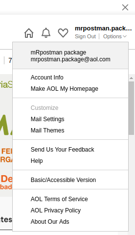

<!-- This document must be rendered in RStudio using the option "knitr with parameters" or rmarkdown::render("MyDocument.Rmd", params = list(password = "my_password"))-->

<!-- README.md is generated from README.Rmd. Please edit .Rmd file -->

# mRpostman 

<!-- # mRpostman  -->

<!-- [](http://www.r-pkg.org/pkg/mRpostman) -->

<!-- one space after links to display badges side by side -->

[](https://travis-ci.org/allanvc/mRpostman)
[](https://cran.r-project.org/package=mRpostman)
[](https://cran.r-project.org/package=mRpostman)
[](https://opensource.org/licenses/GPL-3.0)

IMAP Toolkit for R

## Overview

`mRpostman` provides tools for searching and fetching emails, mailbox
management, attachment extraction, and several other IMAP
functionalities. This package makes extensive use of {curl} and
{libcurl} to implement an easy-to-use IMAP client for R, paving the way
for R users to perform Data Analysis on email data.

mRpostman’s official website: <https://allanvc.github.io/mRpostman>

**IMPORTANT**: Substantial changes without backward compatibility were
implemented between versions 0.3.2 and 0.9.0.0000. Please, check the
[changelog](https://allanvc.github.io/mRpostman/news/index.html) or the
vignette [“Migrating code to mRpostman’s R6
sintaxe”](https://allanvc.github.io/mRpostman/articles/code_migration.html)
for more information.

## First things first … (plain authentication)

Before using **mRpostman**, it is essential to configure your email
account. Many mail providers require authorizing **“less secure apps”**
to access your account from a third part app, using plain
authentication. If you’re interested in OAuth2.0 authentication, check
the “IMAP OAuth2.0 authentication with mRpostman” vignette.

Let’s see how to configure simple plain authentication for Gmail, Yahoo
Mail, AOL Mail, and Office 365.

### Gmail

1)  Go to Gmail website and log in with your credentials.

2)  Then, go to
    <https://myaccount.google.com/u/1/lesssecureapps?pageId=none>

 <!--  -->

3)  Set “Allow less secure apps” to **ON**.

### Yahoo Mail

1)  Go to Yahoo Mail website and log in with your credentials.

2)  Click on “Account Info”.

 <!--  -->

3)  Click on “Account Security” on the left menu.

 <!--  -->

4)  After, set “Allow apps that use less secure sign in” **ON**


<!--  -->

### AOL Mail

1)  Go to AOL Mail website and log in with your credentials.

2)  Click on “Options” and then on “Account Info”.

 <!--  -->

3)  Click on “Account Security” on the left menu.

 <!--  -->

4)  After, set “Allow apps that use less secure sign in” **ON**

 <!--  -->

### Outlook - Office 365

There is no need to execute any external configuration. The parameter
`url` in `configure_imap()` should be set as
`url="imaps://outlook.office365.com"`.

## Introduction

From version 0.9.0.0000 onward, `mRpostman` is implemented under the OO
paradigm, based on an R6 class (`ImapCon`), its derived methods and a
few independent functions with the aim to perform a myriad of IMAP
commands.

The package is divided in 8 groups of operations. Below, we present all
the available methods/functions:

  - 1.  **configuration**: `configure_imap()`;

  - 2.  **server capabilities**: `list_server_capabilities()`

  - 3.  **mailbox operations**: `list_mail_folders()`,
        `select_folder()`, `examine_folder()`, `rename_folder()`,
        `create_folder()`;

  - 4.  **single search**: `search_before()`, `search_since()`,
        `search_period()`, `search_on()`,
        `search_sent_before()`,`search_sent_since()`,
        `search_sent_period()`, `search_sent_on()`, `search_string()`,
        `search_flag()`, `search_smaller_than()`,
        `search_larger_than()`, `search_younger_than()`,
        `search_older_than()`;

  - 5.  **custom search**: `search`
    
    <!-- end list -->
    
      - **custom search helper functions**:
          - relational operators functions: `AND()`, `OR()`;
          - criteria definition functions: `before()`, `since()`,
            `on()`, `sent_before()`, `sent_since()`, `sent_on()`,
            `string()`, `flag()`, `smaller_than()`, `larger_than()`,
            `younger_than()`, `older_than()`;

  - 6.  **fetch**: `fetch_body()`, `fetch_header()`, `fetch_text()`,
        `fetch_metadata()`, `fetch_attachments_list()`,
        `fetch_attachments()`;

  - 7.  **attachments**: `list_attachments()`, `get_attachments()`,
        `fetch_attachments_list()`, `fetch_attachments()`;

  - 8.  **complementary operations**: `copy_msg()`, `move_msg()`,
        `delete_msg()`, `expunge()`, `esearch_count()`,
        `esearch_min_id()`, `esearch_max_id()`, `add_flags()`,
        `remove_flags()`, `replace_flags()`;

## Installation

``` r
# CRAN version
install.packages("mRpostman")

# Dev version
if (!require('remotes')) install.packages('remotes')
remotes::install_github("allanvc/mRpostman")
```

## Basic Usage

### 1\) Configuring an IMAP connection and listing server’s capabilities

``` r

library(mRpostman)

# Outlook - Office 365
con <- configure_imap(url="imaps://outlook.office365.com",
                      username="your_user@company.com",
                      password=rstudioapi::askForPassword()
)

# other IMAP providers that were tested: GMail (imaps://imap.gmail.com), 
#   Yahoo (imaps://imap.mail.yahoo.com/), AOL (imaps://export.imap.aol.com/),
#   Yandex (imaps://imap.yandex.com)

# you can try another IMAP server and see if it works

con$list_server_capabilities()
```

### 2\) Listing your mail folders and select “INBOX”

``` r

# Listing
con$list_mail_folders()

# Selecting
con$select_folder(name = "INBOX")
```

### 3\) Searching messages by date, with a flag as additional filter

``` r

res1 <- con$search_on(date_char = "02-Jan-2020")

res1
```

### 4\) Customizing a search with multiple criteria

``` r

# messages that contain either "@k-state.edu" OR "ksu.edu" in the "TO" header field
res2 <- con$search(OR(
  string(expr = "@k-state.edu", where = "TO"),
  string(expr = "@ksu.edu", where = "TO")
))

res2
```

### 5\) Fetch messages’ text using single-search results

``` r

res3 <- con$search_string(expr = "Welcome!", where = "SUBJECT") %>%
  con$fetch_text(write_to_disk = TRUE) # also writes results to disk

res3
```

## 6\) Attachments

You can list the attachments of one or more messages with:

1)  the `list_attachments()` function:

<!-- end list -->

``` r

con$search_since(date_char = "02-Jan-2020") %>%
  con$fetch_text() %>% # or with fetch_body()
  list_attachments() # does not depend on the 'con' object
```

… or more directly with:

2)  `fetch_attachments_list()`

<!-- end list -->

``` r

con$search_since(date_char = "02-Jan-2020") %>%
  con$fetch_attachments_list()
```

If you want to download the attachments of one or more messages, there
are two ways of doing that as well.

1)  Using the `get_attachments()` method:

<!-- end list -->

``` r

con$search_since(date_char = "02-Jan-2020") %>%
  con$fetch_text() %>% # or with fetch_body()
  con$get_attachments()
```

… and more directly with the

2)  `fetch_attachments()` method:

<!-- end list -->

``` r

con$search_since(date_char = "02-Jan-2020") %>%
  con$fetch_attachments()
```

## Future Improvements

  - add further IMAP functionalities.
  - eliminate the stringr dependency
  - implement a progress bar in fetch operations

## License

This package is licensed under the terms of the GPL-3 License.

## References

Crispin, M., *INTERNET MESSAGE ACCESS PROTOCOL - VERSION 4rev1*, RFC
3501, DOI: 10.17487/RFC3501, March 2003,
<https://tools.ietf.org/html/rfc3501>.

Ooms, J. curl: *A Modern and Flexible Web Client for R*. R package
version 3.3, 2019, <https://CRAN.R-project.org/package=curl>

Stenberg, D. *Libcurl - The Multiprotocol File Transfer Library*,
<https://curl.haxx.se/libcurl/>
