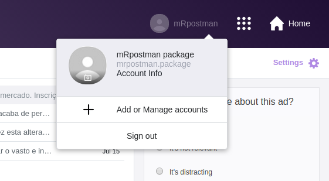

<!-- This document must be rendered in RStudio using the option "knitr with parameters" or rmarkdown::render("MyDocument.Rmd", params = list(password = "my_password"))-->

<!-- README.md is generated from README.Rmd. Please edit .Rmd file -->

# mRpostman 

<!-- # mRpostman  -->

<!-- [](http://www.r-pkg.org/pkg/mRpostman) -->

<!-- one space after links to display badges side by side -->

[](https://travis-ci.org/allanvc/mRpostman)
[](https://cran.r-project.org/package=mRpostman)
[](https://cran.r-project.org/package=mRpostman)
[](https://opensource.org/licenses/GPL-3.0)

IMAP Toolkit for R

## Overview

**mRpostman** makes extensive use of ‘curl’ and ‘libcurl’ capabilities,
providing functions for mailboxes and electronic messages manipulation,
such as moving, deleting, and searching messages using specific
criteria, setting and clearing flags, selective fetching of message
attributes and more.

mRpostman website: <https://allanvc.github.io/mRpostman>

## First things first …

Before using **mRpostman**, it is essential to configure your email
account. Many mail providers require authorizing **“less secure apps”**
to access your account from a third part app.

See how to do it for Gmail, Yahoo Mail and AOL Mail.

### Gmail

1)  Go to Gmail website and log in with your credentials.

2)  Then, go to
    <https://myaccount.google.com/u/1/lesssecureapps?pageId=none>


3)  Set “Allow less secure apps” to **ON**.

### Yahoo Mail

1)  Go to Yahoo Mail website and log in with your credentials.

2)  Click on “Account Info”.



3)  Click on “Account Security” on the left menu.


4)  After, set “Allow apps that use less secure sign in” **ON**


### AOL Mail

1)  Go to AOL Mail website and log in with your credentials.

2)  Click on “Options” and then on “Account Info”.


3)  Click on “Account Security” on the left menu.


4)  After, set “Allow apps that use less secure sign in” **ON**


## Introduction

The package is divided in 8 groups of functions:

  - **configuration**: `configure_imap()`;
  - **mailboxes commands**: `list_mailboxes()`, `select_mailbox()`,
    `examine_mailbox()`, `rename_mailbox();`
  - **options listing**: `list_server_capabilities()`,`flag_options()`,
    `section_or_field_options()`, `metadata_options()`;
  - **search**: `search_before()`, `search_since()`, `search_period()`,
    `search_on()`, `search_sent_before()`,`search_sent_since()`,
    `search_sent_period()`, `search_sent_on()`, `search_string()`,
    `search_flag()`, `search_smaller_than()`, `search_larger_than()`,
    `search_younger_than()`, `search_older_than()`, `custom_search()`;
  - **custom search helper functions**:
      - relational operators functions: `AND()`, `OR()`;
      - criteria definition functions: `before()`, `since()`, `on()`,
        `sent_before()`, `sent_since()`, `sent_on()`, `string()`,
        `flag()`, `smaller_than()`, `larger_than()`, `younger_than()`,
        `older_than()`;
  - **fetch**: `fetch_full_msg()`, `fetch_msg_header()`,
    `fetch_msg_text()`, `fetch_msg_metadata()`;
  - **attachments**: `list_attachments()`, `get_attachments()`;
  - **miscellania**: `copy_msg()`, `get_min_id()`, `get_max_id()`,
    `delete_msg()`, `expunge()`, `add_flags()`, `remove_flags()`,
    `replace_flags()`, `move_msg()`.

## Installation

``` r
# CRAN version
install.packages("mRpostman")

# Dev version
if (!require('remotes')) install.packages('remotes')
remotes::install_github("allanvc/mRpostman")
```

## Basic Usage

### 1\) Configuring IMAP and listing mailboxes

``` r

library(mRpostman)

# IMAP settings
# Gmail
imapconf <- configure_imap(url="imaps://imap.gmail.com",
                           username="your_user",
                           password=rstudioapi::askForPassword()
                          )

# Yahoo Mail
# imapconf <- configure_imap(url="imaps://imap.mail.yahoo.com/",
#                            username="your_user",
#                            password=rstudioapi::askForPassword()
#                           )

# AOL Mail
# imapconf <- configure_imap(url="imaps://export.imap.aol.com/",
#                            username="your_user",
#                            password=rstudioapi::askForPassword()
#                           )

# Yandex Mail
# imapconf <- configure_imap(url="imaps://imap.yandex.com",
#                            username="your_user",
#                            password=rstudioapi::askForPassword()
#                           )

# you can try another IMAP server and see if it works

# Listing
imapconf %>%
  list_mailboxes()
```

### 2\) Examining a Mailbox

``` r

# examine mailbox -- number of existent and recent messages
imapconf %>%
  select_mailbox(mbox = "UC Riverside") %>% # mbox names are case sensitive
  examine_mailbox()
```

### 3\) Searching by period using a flag

``` r

# search
results <- imapconf %>%
  select_mailbox(mbox = "INBOX") %>%
  search_period(since_date_char = "17-May-2018",
                before_date_char = "30-Jun-2019",
                flag = "ANSWERED")

results$msg_id
```

### 4\) Searching for a string in the “Text” section of messages

``` r

# search
results <- imapconf %>%
  select_mailbox(mbox = "UC Riverside") %>%
  search_string(section_or_field = "TEXT", string = "Welcome!")

results$msg_id
```

### 5\) Fetch headers after searching

``` r

results <- imapconf %>%
  select_mailbox(mbox = "UC Riverside") %>%
  search_string(section_or_field = "TEXT", string = "Welcome!") %$% # exposition pipe, not %>%!!
  fetch_msg_header(imapconf = imapconf, 
                   msg_id = msg_id, 
                   fields = c("DATE", "SUBJECT"))

results
```

## 6\) Attachments

This will list all the attachments filenames for each fetched message.

``` r
imapconf %>%
  select_mailbox(mbox = "INBOX") %>%
  search_since(date_char = "23-Sep-2019") %$%
  fetch_full_msg(imapconf, msg_id=msg_id) %>%
  list_attachments()
```

This extracts and decode your `base64` text attachments from messages,
and save them locally.

``` r
imapconf %>%
  select_mailbox(mbox = "INBOX") %>%
  search_since(date_char = "23-Sep-2019") %$%
  fetch_full_msg(imapconf, msg_id=msg_id) %>%
  get_attachments()
```

## Future Improvements

  - better error handling and messages;

  - add further IMAP functionalities;

  - include **SMTP support** for sending emails.

If you want to contribute, specially with the SMTP support, please
contact the package mantainer.

## License

This package is licensed under the terms of the GPL-3 License.

## References

Crispin, M., *INTERNET MESSAGE ACCESS PROTOCOL - VERSION 4rev1*, RFC
3501, DOI: 10.17487/RFC3501, March 2003,
<https://www.rfc-editor.org/info/rfc3501>.

Ooms, J. curl: *A Modern and Flexible Web Client for R*. R package
version 3.3, 2019, <https://CRAN.R-project.org/package=curl>

Stenberg, D. *Libcurl - The Multiprotocol File Transfer Library*,
<https://curl.haxx.se/libcurl/>
