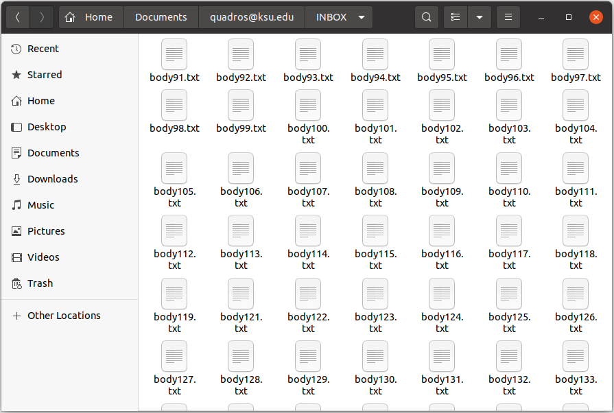

# mRpostman basics

## Introduction

`mRpostman` is an easy-to-use IMAP client that provides tools for
message searching, selective fetching of message attributes, mailbox
management, attachment extraction, and several other IMAP features,
paving the way for email data analysis in R. To do so, this package
makes extensive use of the {curl} package and the libcurl C library.

In this vignette, we present all available methods and functions of this
package, but not all the possibilities one can explore.

**IMPORTANT**:

0.  In 2026 the package went through a deep refactoring, released as
    version `3.0.0`. Everything written for 1.x/2.x keeps working, but
    four things changed for the better: (i) `query()` is now the
    canonical way to search - every `search_*()` method and the
    `AND()`/`OR()` combinators keep working as soft-deprecated spellings
    (they warn once per session); (ii) attachments have a consolidated
    API - `attachments()`, `attachments_manifest()`, and
    `extract_attachments()`; (iii) `use_uid`, `mute`, and `retries` can
    be set once, in `configure_imap()`, as connection-level defaults -
    and **`use_uid` now defaults to `TRUE`** (UIDs are stable; sequence
    numbers renumber on expunge; set `use_uid = FALSE` to restore the
    old behavior); (iv) failures are classed conditions
    (e.g. `mRpostman_server_error`) that `tryCatch()` can handle by
    kind.

1.  In version `0.9.0.0`, `mRpostman` went through substantial changes,
    including ones that have no backward compatibility with versions
    `<= 0.3.1`. If you have code written with the deprecated syntax of
    versions `<= 0.3.1`, please refer to the package’s `NEWS.md` file
    for an overview of the changes introduced in `0.9.0.0`.

2.  Old versions of the libcurl C library ({curl}’s main engine) will
    cause malfunctioning of this package. If your libcurl’s version is
    above 7.58.0, you should be fine. If you intend to use OAuth 2.0
    authentication, then you will need libcurl \>= 7.65.0. To know more
    about the OAuth 2.0 authentication in this package, refer to the
    [*“Using IMAP OAuth2.0 authentication in
    mRpostman”*](https://allanvc.github.io/mRpostman/articles/xoauth2.0.html)
    vignette.

3.  Most mail providers discontinued less secure apps access. If it is
    still available and you are comfortable with this type of access you
    can enable this option for your account on your mail provider. Some
    providers, such as Yahoo Mail, also offer the option to generate a
    password to be used by third-party apps such as mRpostman. The other
    option, as mentioned above, is to set up OAuth2 (two-factor
    authentication) in order to access your mailbox. Please also refer
    to the [*“Using IMAP OAuth2.0 authentication in
    mRpostman”*](https://allanvc.github.io/mRpostman/articles/xoauth2.0.html)
    vignette.

## Providers and their IMAP urls

| **Provider**                       | **IMAP Server**           |
| ---------------------------------- | ------------------------- |
| Gmail                              | `imap.gmail.com`          |
| Office 365                         | `outlook.office365.com`\* |
| Outlook.com (Hotmail and Live.com) | `imap-mail.outlook.com`   |
| Yahoo Mail                         | `imap.mail.yahoo.com`     |
| iCloud Mail                        | `imap.mail.me.com`        |
| AOL Mail                           | `imap.aol.com`            |
| Zoho Mail                          | `imap.zoho.com`           |
| Yandex Mail                        | `imap.yandex.com`         |
| GMX Mail                           | `imap.gmx.com`            |
| Mail.com                           | `imap.mail.com`           |
| FastMail                           | `imap.fastmail.com`       |

\* For Office 365 accounts, the `username` should be set as
`user@yourcompany.com` or `user@youruniversity.edu` for example.

## Package Structure

The package is now implemented under an OO framework, using an R6 class.
The main functionalities of `mRpostman` are implemented as methods of
the R6 class called `ImapCon`. There are also a few independent
functions. All methods and functions are described below:

  - **configuration methods**: `configure_imap()` (including the
    connection-level defaults `use_uid`, `mute`, and `retries`),
    `reset_url()`, `reset_username()`, `reset_password()`,
    `reset_verbose()`, `reset_buffersize()`, `reset_timeout_ms()`,
    `reset_xoauth2_bearer()`;
  - **server-capabilities methods**: `list_server_capabilities()`,
    `has_capability()`;
  - **mailbox-operations methods**: `list_mail_folders()`,
    `select_folder()`, `examine_folder()`, `rename_folder()`,
    `create_folder()`, `list_flags()`;
  - **the search method**: `query()` - an ordinary R expression,
    e.g. `con$query((subject == "budget" | "budget 3") & flag !=
    "SEEN")`;
  - **the custom-search method**: `search()`, with the criteria
    constructors `before()`, `since()`, `on()`, `sent_before()`,
    `sent_since()`, `sent_on()`, `string()`, `flag()`, `smaller_than()`,
    `larger_than()`, `younger_than()`, `older_than()`, `verbatim()`,
    combined with R’s own `&`, `|`, and `!`;
  - **deprecated search spellings** (they keep working, warning once per
    session): the `search_*()` single-criterion methods and the
    `AND()`/`OR()` combinators;
  - **fetch methods**: `fetch_body()`, `fetch_header()`, `fetch_text()`,
    `fetch_metadata()`;
  - **attachments**: `attachments_manifest()` (list without
    downloading), `attachments()` (download, guided by the
    `BODYSTRUCTURE`), and the exported `extract_attachments()` (from
    already-fetched bodies); the pre-3.0.0 names remain as deprecated
    aliases;
  - **complementary methods**: `copy_msg()`, `move_msg()`,
    `esearch_min_id()`, `esearch_max_id()`, `esearch_count()`,
    `delete_msg()`, `expunge()`, `add_flags()`, `remove_flags()`,
    `replace_flags()`.

## 1\) How do I start? (Connection configuration)

After setting the authentication method in your mail provider, you have
to configure an IMAP connection:

``` r
library(mRpostman)

# IMAP settings

# Outlook - Office 365
con <- configure_imap(
  url="imaps://outlook.office365.com",
  username="user@your_company.com",
  password=rstudioapi::askForPassword()
  )

# Gmail
con <- configure_imap(
  url = "imaps://imap.gmail.com",
  username = "user",
  password = rstudioapi::askForPassword()
  )

# Hotmail
con <- configure_imap(
  url = "imaps://imap-mail.outlook.com",
  username = "user@hotmail.com",
  password = rstudioapi::askForPassword()
  )

# Yahoo Mail
con <- configure_imap(
  url="imaps://imap.mail.yahoo.com/",
  username="your_user",
  password=rstudioapi::askForPassword()
  )

# AOL Mail
con <- configure_imap(
  url="imaps://export.imap.aol.com/",
  username="your_user",
  password=rstudioapi::askForPassword()
  )

# Yandex Mail
con <- configure_imap(
  url="imaps://imap.yandex.com",
  username="your_user",
  password=rstudioapi::askForPassword()
  )

# ... and any other mail provider with IMAP support
```

Other useful options are: `timeout_ms`, `verbose = TRUE`, `buffersize`.
Further {curl} options related to IMAP functionalities can be passed to
`configure_imap()`, but you probably won’t need it. See
`curl::curl_options()`.

Since version `0.9.0.0`, this package provides more flexibility to the
user in the sense that you can modify the connection parameters for
specific commands or parts of a script, using the `reset_*()` methods.
This prevents users from having to call `configure_imap()` multiple
times during a session or in a script. It is particularly useful when
the user is going to perform some fetch operation, for example. In this
case, it is recommended to increase the `timeout_ms` and set `verbose =
FALSE`.

The `con` object that we created in the example above has the `ImapCon`
R6 class. Now, almost 99% of the other IMAP commands to be performed on
the server will be called following the structure: `con$method()`. The
exceptions are the `list_attachments()` function and the helper
functions of the custom-search group.

As you will see, the R6 framework combined with {curl} will make this
package work like a session-based IMAP client. Besides this, for some
commands, users will be able to use the tidy approach with pipes. All
this together provides an elegant way of accessing your IMAP provider,
searching and fetching emails, and managing your mailbox as well.

Since 3.0.0, three arguments that used to be repeated on every call can
be set once, as connection-level defaults: `configure_imap(..., mute =
TRUE, retries = 2)` makes every method stay quiet and retry twice,
unless a specific call overrides it. `use_uid` is one of them and now
**defaults to `TRUE`**: UIDs are stable for the lifetime of a message,
while sequence numbers renumber whenever messages are expunged; pass
`use_uid = FALSE` (per connection or per call) if you need sequence
numbers.

## 2\) Server capabilities

Once the connection is configured, it is important to know which
capabilities your IMAP provider offers to users. This impacts on which
type of operations you are allowed to perform. For example, if your
server has the `WITHIN` extension you can use the WITHIN search methods
`search_younger_than()` and `search_older_than()`; if the server has the
`ESEARCH` capability, besides being allowed to use the `esearch_*()`
methods, you can optimize all your search functions with the `esearch =
TRUE` parameter; if you see the `MOVE` capability, then you can use the
`move_msg()` method. Therefore, to know all your server capabilities,
you can use `list_server_capabilities`.

``` r
con$list_server_capabilities()
```

## 3\) Mailbox commands

### 3.1) Listing folders

``` r
con$list_mail_folders()
```

### 3.2) Creating a new folder

``` r
con$create_folder(folder = "New Folder")
```

Except for `examine_folder()` and `rename_folder()`, from now on, you
will have to select a folder to issue further commands.

### 3.3) Selecting a folder

``` r
con$select_folder(folder = "INBOX")
```

Probably, the main folder in your mailbox will be the `"INBOX"`. You can
select it without having to worry about the case of the letters.
However, all the other folders in a mailbox are case sensitive.

### 3.4) Examining a folder

Count the number of existent and recent messages in the previously
selected folder.

``` r
con$select_folder(folder = "Inbox")

con$examine_folder()
```

If you want to examine a folder that is not the currently selected one
(`INBOX`), you can achieve this by specifying the name.

``` r
con$examine_folder(folder = "Sent")
```

### 3.5) Renaming a folder

The following will rename the selected folder.

``` r
con$select_folder(folder = "CRAN Messages")

con$rename_folder(new_name = "CRAN")
```

There is a `reselect` argument, which by default is set to `TRUE`. This
will cause the automatic re-selection of the new folder name.

If you want to rename a folder that is different from the currently
selected one (`CRAN`), you can achieve this by specifying the name.

``` r
con$rename_folder(folder = "Sent", new_name = "Sent2")
```

### 3.6) Flags listing

Flags work like tags or labels attached to messages. After a mail folder
is selected, you can check which flags are available, and if you are
allowed to set custom flags of your own in this folder with
`list_flags()`.

``` r
con$list_flags()
```

### 3.7) Deleting a folder

The following deletes a mail folder (IMAP “DELETE”). The folder name
must be provided explicitly (there is no implicit deletion of the
currently selected folder).

``` r
con$delete_folder(folder = "Old Folder")
```

### 3.8) Subscribing to a folder

`subscribe_folder()` adds a folder to the set of subscribed (active)
folders (IMAP “SUBSCRIBE”).

``` r
con$subscribe_folder(folder = "INBOX")
```

### 3.9) Unsubscribing from a folder

`unsubscribe_folder()` removes a folder from the subscribed set (IMAP
“UNSUBSCRIBE”).

``` r
con$unsubscribe_folder(folder = "INBOX")
```

### 3.10) Listing subscribed folders

While `list_mail_folders()` lists every folder (IMAP “LIST”),
`list_subscribed_folders()` lists only the subscribed ones (IMAP
“LSUB”).

``` r
con$list_subscribed_folders()
```

### 3.11) Folder status

`status()` returns a folder’s counters via IMAP “STATUS” **without
selecting it** (unlike `examine_folder()`). You can request any subset
of `MESSAGES`, `RECENT`, `UIDNEXT`, `UIDVALIDITY`, and `UNSEEN`.

``` r
con$status(folder = "INBOX")

# or only some items, for the currently selected folder:
con$select_folder("INBOX")
con$status(items = c("MESSAGES", "UNSEEN"))
```

### 3.12) Listing special-use folders

Servers advertising the “SPECIAL-USE” capability (RFC 6154) tag folders
with a role such as `\Sent`, `\Drafts`, `\Junk`, `\Trash`, `\Archive`,
`\All`, or `\Flagged`. `list_special_use_folders()` returns a
`data.frame` mapping each such folder to its attribute.

``` r
con$list_special_use_folders()
```

### 3.13) Server namespaces

`namespace()` issues the IMAP “NAMESPACE” command (RFC 2342), returning
the personal, other users’, and shared namespace prefixes and their
hierarchy delimiters.

``` r
con$namespace()
```

### 3.14) Folder quota

On servers advertising the “QUOTA” capability (RFC 2087),
`get_quota_root()` returns the quota root(s) of a folder and their
usage/limits as a `data.frame` (`STORAGE` is reported in kibibytes). If
you already know the quota root, `get_quota()` queries it directly.

``` r
con$get_quota_root(name = "INBOX")

# or, for a known quota root:
con$get_quota(quota_root = "")
```

### 3.15) Closing a folder

`close_folder()` closes the selected folder (IMAP “CLOSE”),
**permanently removing** the messages flagged `\Deleted`.
`unselect_folder()` (IMAP “UNSELECT”, RFC 3691) does the same
**without** expunging. After either, no folder is selected.

``` r
con$select_folder("INBOX")

con$close_folder()      # closes and expunges \Deleted
# or:
con$unselect_folder()   # closes without expunging
```

### 3.16) Client/server identification

`id()` issues the IMAP “ID” command (RFC 2971). Called without arguments
it asks for the server’s id; you can also disclose the client id by
passing a named vector.

``` r
con$id()

# optionally disclosing the client id:
con$id(fields = c(name = "mRpostman", version = "1.2.1"))
```

## 4\) Single-search (deprecated spellings)

**NOTE (3.0.0):** every search in this section has a direct spelling in
the canonical `query()` interface of [Section
9](#the-query-language-canonical-since-300) -
e.g. `con$search_before(date_char = "02-Jan-2020")` is `con$query(date
< "2020-01-02")`. The methods below keep working, but signal a
deprecation warning once per session.

All search methods will return a numeric vector containing the results
from the search. This allows users to chain fetch operations together
with search one. You can also **NEGATE** all search expressions by
setting `negate = TRUE`.

If your server supports **ESEARCH**, we recommend you to use it. It will
prevent your results from being truncated when there are too many
message ids and you didn’t set a high `buffersize` in
`configure_imap()`[¹](#fn1). With “ESEARCH”, the results will be
condensed to groups of sequences similar to what does. For instance, if
your search returns 10000 results, it is better to have condensed groups
such as `1:10, 12, 23:27, ...` instead of a sequence of
`1, 2, 3, 4, 5, 6, ..., 10, 12, 23, 24, 25, ...`. If you can’t use
ESEARCH, or if your results are being truncated even with ESEARCH, you
can try to increase your buffersize in `configure_imap()` to avoid this.

### 4.1) Search by date

`search_before()`, `search_since()`, `search_on()`, and
`search_period()` use internal date, which reflects the moment when the
message was received. `search_sent_before()`, `search_sent_since()`,
`search_sent_on()`, and `search_sent_period()` use the RFC-2822 date
header (origination date), which “specifies the date and time at which
the creator of the message indicated that the message was complete and
ready to enter the mail delivery system” (Resnick, 2008). Dates in both
methods must be the same most of the time. The difference may occur when
you copied or moved some messages between folders. In this case, the
RFC-2822 date header of the copied/moved messages in the destination
folder will point out to the date of the copy. Another difference is
that searching by the internal date will probably be faster because this
information is kept in a database outside the message.

#### 4.1.1) By internal date

#### 4.1.1.1) Before a date

``` r
con$select_folder(folder = "INBOX")

res <- con$search_before(date_char = "07-Sep-2020")

res
```

You can use the “UID” (unique identifier) instead of the message
sequence number [²](#fn2), and one or more flags as an additional filter
to your search. In fact, you can use this in almost every search method
of this package.

``` r
res <- con$search_before(date_char = "07-Sep-2020",
                         use_uid = TRUE,
                         flag = c("ANSWERED", "SEEN"))

res
```

Remember that, if your IMAP server has the ESEARCH capability, you can
use it. Gmail is one of the mail providers that allow it.

``` r
res <- con$search_before(date_char = "07-Sep-2020",
                         use_uid = TRUE,
                         flag = c("ANSWERED", "SEEN"),
                         esearch = TRUE)

res
```

You can also **NEGATE** the statement to search for messages **NOT
BEFORE a date**, for example:

``` r
res <- con$search_before(date_char = "07-Sep-2020",
                         negate = TRUE,
                         use_uid = TRUE)
                         
res
```

#### 4.1.1.2) Since a date

The previous operation, in which we have used `negate = TRUE`, is
equivalent to search for messages received **SINCE a DATE**:

``` r
res <- con$search_since(date_char = "07-Sep-2020",
                        use_uid = TRUE)
                         
res
```

#### 4.1.1.3) By period

``` r
res <- con$search_period(since_date_char = "02-Jan-2020",
                         before_date_char = "30-Jun-2020")
                         
res
```

You can **NEGATE** a period search as well. In this case, the search
will exclude messages from the specified period.

``` r
res <- con$search_period(since_date_char = "02-Jan-2020",
                         before_date_char = "30-Jun-2020",
                         negate = TRUE)
                         
res
```

#### 4.1.1.4) On a specific date

``` r
con$search_on(date_char = "02-Jan-2020")
```

#### 4.1.2) By origination date

#### 4.1.2.1) Sent before a date

``` r
con$search_sent_before(date_char = "07-Sep-2020")
```

You can modify some of the search parameters as well:

``` r
res <- con$search_sent_before(date_char = "07-Sep-2020",
                              negate = TRUE,
                              use_uid = TRUE,
                              flag = c("ANSWERED", "SEEN"))

res
```

#### 4.1.2.2) Sent since a date

``` r
con$search_sent_since(date_char = "07-Sep-2020")
```

#### 4.1.2.3) Sent by period

``` r
con$search_sent_period(since_date_char = "02-Jan-2020",
                       before_date_char = "30-Jun-2020")
```

#### 4.1.2.4) Sent On a specific date

``` r
con$search_sent_on(date_char = "30-Jun-2020")
```

### 4.2) Search by string

You can search for a simple string or compound expression either in the
whole message, in a section, or in a specific header field. One
important thing to know is that the SEARCH command in the IMAP server is
not case sensitive.

You can also **NEGATE** the statement and search for messages (or a
specific part of a message) not containing that string, and add
additional flag filters as well.

For the next examples, we are going to select a different mail folder.

Searching in the “TO” header field:

``` r
con$select_folder(folder = "K-State")

con$search_string(expr = "xpto@k-state.com", where = "TO")
```

Searching in the “FROM” header field:

``` r
con$search_string(expr = "xpto@k-state.edu", where = "FROM")
```

Searching in the “SUBJECT” header field:

``` r
con$search_string(expr = "PhD offer", where = "SUBJECT")
```

Searching in the “TEXT” section.

**IMPORTANT**: Since the text may contain raw data, it may not be a
super-effective search. In this case, searching for an expression in the
whole `"BODY"` may be preferred.

``` r
con$search_string(expr = "Dear Allan" where = "TEXT")
```

Searching in the “BODY” section.

``` r
con$search_string(expr = "Dear Allan" where = "BODY")
```

### 4.3) Search by flag

``` r
con$search_flag(name = c("ANSWERED", "Seen"), use_uid = TRUE)
```

Remember that you can check the available flags in a mail folder with
`list_flags()`.

### 4.4) Search by size

The size is specified in bytes.

#### 4.4.1) Smaller than

``` r
con$search_smaller_than(size = 512000) # smaller than 512KB
```

#### 4.4.1) Larger than

``` r
con$search_larger_than(size = 512000) # larger than 512KB
```

### 4.5) Search by within extension

Servers with support to the “WITHIN” EXTENSION enable searching for
messages within a span, i.e. younger than “x” seconds, or older than “x”
seconds. This capability is really rare to find in IMAP servers, but
`mRpostman` has two methods implemented for coping with this capability
if it is available.

#### 4.5.1) Younger than

``` r
con$search_younger_than(seconds = 3600) # msgs received less than one hour (3600 sec)
```

#### 4.5.2) Older than

``` r
con$search_older_than(seconds = 3600) # msgs received more than one hour ago (3600 sec)
```

### 4.6) Server-side sort (SORT)

Servers advertising the “SORT” capability (RFC 5256) can order the
results on the server side. `sort()` returns the message ids in the
server-provided order (it does **not** re-sort them locally). Check the
capability with `list_server_capabilities()`.

``` r
con$select_folder(folder = "INBOX")

# most recent first:
con$sort(by = "DATE", reverse = TRUE)

# sort a restricted set (search criteria) by sender:
con$sort(by = "FROM", criteria = "SINCE 01-Jan-2020")
```

### 4.7) Server-side thread (THREAD)

Servers advertising a “THREAD=” capability (RFC 5256) can group messages
into threads. `thread()` returns a list of integer vectors, one per
top-level thread (nested parent/child ids are flattened into their
thread).

``` r
con$select_folder(folder = "INBOX")

con$thread(algorithm = "REFERENCES")
```

## 5\) Custom-search

The `search()` method and its **helper functions** enable users to
create a vast number of complex and customized search requests by
combining different criteria, using all the types of searches previously
presented in this document.

These are the helper functions you can use inside `search()`:

1.  Relational operators: R’s own `&`, `|`, and `!` (the `AND()` and
    `OR()` helpers keep working, but are deprecated since 3.0.0); 2)
    Criteria definition: `before()`, `since()`, `on()`, `sent_before()`,
    `sent_since()`, `sent_on()`, `string()`, `flag()`, `smaller_than()`,
    `larger_than()`, `younger_than()`, and `older_than()`.

**NOTE**: IMAP queries follow Polish notation, i.e. operators such as
`OR` come before arguments, e.g. “OR argument1 argument2”. Therefore,
the relational operators functions in this package should be used like
the following examples: `OR(before(date_char = "17-Apr-2015"),
string(expr = "Jimmy", where = "FROM"))`. Even though there is no “AND”
operator in the IMAP protocol, this package adds a helper function
`AND()` to indicate multiple arguments that must be searched together,
e.g. `AND(since(date_char = "01-Jul-2018"), larger_than(size = 16000))`.

**Example 1**: Searching for messages (in “INBOX”) containing the string
“Kansas State University” in the “SUBJECT” header field **AND** that
were received before “02-Jan-2020”.

``` r
con$select_folder(folder = "INBOX")


res <- con$search(request = AND(string(expr = "Kansas State University", where = "SUBJECT"),
                                before(date_char = "02-Jan-2020")))

res
```

**Example 2**: Searching (using UID) for messages received from
“@k-state.edu” **OR** “@ksu.edu”.

``` r
con$search(request = OR(string(expr = "@k-state.edu", where = "FROM"),
                        string(expr = "@ksu.edu", where = "FROM")),
           use_uid = TRUE)
```

## 6\) Fetch

You can fetch the full content of messages, or their parts, such as the
header, text, or specific metadata fields. Besides this, you can also
fetch a message attachments list or the attachment files themselves,
downloading them to the disk.

We usually fetch messages after a search operation. Given the output of
the search functions in **mRpostman**, you can use the pipe `%>%` to
chain the search and the fetch operations together. Using the base R
approach is perfectly possible as well.

In the main fetch methods (those that are not related to attachment
fetching), you can choose to write the fetch results to disk (working
directory) using `write_to_disk = TRUE`. If you opt to do so,
**mRpostman** saves the fetched content to a `.txt` file in the
following folder structure: `working directory > imap.server.url > mail
folder name`. The text files will be named after the id of the fetched
message. If the operation was executed using the UID, the “UID” prefix
is added to the file names.

**IMPORTANT**:

1.  If the fetch operation is to be chained after a search, the
    `use_uid` arguments in the two operations have to be the same.
    Otherwise, an error will occur or the fetch will be performed on
    wrong messages’ ids.

2.  It is always recommended to increase the timeout\_ms before
    `fetch_body()`, `fetch_text()`, and `fetch_attachments()` operations
    as sometimes the operation may hang for a few seconds while fetching
    the message parts.

3.  if you have configured a connection with `verbose = TRUE`, it is
    extremely recommended that you reset it to `FALSE` before a fetching
    operation. The `verbose = TRUE` option fills the console with the
    whole flux of information between the server and the client,
    drastically slowing the speed of the process and your R session.

### 6.1) Fetch body

``` r
# increasing timeout_ms
con$reset_timeout_ms(x = 30000) # ... to 30 secs

# and supposing that you had verbose = TRUE before
con$reset_verbose(x = FALSE)

# tidy approach
con$search_string(expr = "@k-state.edu", where = "FROM") %>%
  con$fetch_body(write_to_disk = TRUE, keep_in_mem = FALSE)

# ---------------

# base R approach
res <- con$search_string(expr = "@k-state.edu", where = "FROM")

con$fetch_body(msg_id = res, write_to_disk = TRUE, keep_in_mem = FALSE)
```

Since the goal here is to write the fetch results to disk, it is
recommended that we set `keep_in_mem = FALSE`. This will optimize the
whole operation because `mRpostman` will clean the memory after fetching
each message as we are not going to use the results in our R session.

Our local folder will be populated with the `.txt` files of the fetched
messages:



### 6.2) Fetch header

``` r
# tidy approach
out <- con$search_since(date_char = "15-Aug-2019", use_uid = TRUE) %>%
  con$fetch_header(use_uid = TRUE, fields = c("DATE", "SUBJECT"))

out

# ---------------

# base R approach
res <- con$search_since(date_char = "15-Aug-2019", use_uid = TRUE)

out <- con$fetch_header(use_uid = TRUE, fields = c("DATE", "SUBJECT"))

out
```

Please, note that, in the example above, we are saving the results to
the `out` object in our R session. Also note that we are setting
`use_uid = TRUE` in both search and fetch requests.

### 6.3) Fetch text

`fetch_text()` is almost as costly as `fetch_body()`. So, it is a good
idea to keep a “high” `timeout_ms`.

``` r
con$search_since(date_char = "15-Aug-2019") %>%
  con$fetch_text(write_to_disk = TRUE, keep_in_mem = FALSE)
```

### 6.4) Fetch metadata

``` r
out <- con$search_on(date_char = "15-Aug-2019", use_uid = TRUE) %>%
  con$fetch_metadata(use_uid = TRUE, attribute = c("INTERNALDATE", "UID", "ENVELOPE"))
```

If nothing is specified to the `metadata` argument, all the metadata
fields are fetched by default. To know which are the metadata options of
a message, refer to `metadata_options()`.

There are two more fetch methods, but they are going to be presented in
the next session since they are related to a very special fetch
operation.

## 7\) Attachments

Since 3.0.0 the attachment family has three entry points: two methods
that talk to the server, and one exported function that works offline on
messages you already fetched. (The pre-3.0.0 names -
`fetch_attachments_list()`, `fetch_attachments()`,
`fetch_attachment_parts()`, `get_attachments()`, and
`list_attachments()` - keep working as deprecated aliases.)

### 7.1) Listing attachments without downloading

`attachments_manifest()` reads each message’s `BODYSTRUCTURE` metadata -
one round trip, no payload - and returns one data frame per message
(zero rows when a message has no attachments):

``` r
con$attachments_manifest(con$query(size > 1e6))
```

### 7.2) Downloading attachments

`attachments()` downloads guided by the same `BODYSTRUCTURE`: exact MIME
part numbers, nested multiparts included, one `BODY.PEEK[part]` fetch
per attachment, decoded according to the declared transfer encoding.
`dest` sets the destination directory (one folder per message), and
`parts` restricts the download to specific MIME parts:

``` r
manifest <- con$query(subject == "report" & flag != "SEEN") %>%
  con$attachments(dest = "~/attachments")
manifest # one row per file: id, part, filename, type, size, path
```

### 7.3) Extracting from already-fetched messages (offline)

If the full messages are already in your session (fetched with
`fetch_body()`), `extract_attachments()` walks the MIME multipart tree
locally, with no further server round trip. With `dest = NULL` (default)
it only reports; with a path it also writes the files:

``` r
out <- con$query(size > 1e6) %>% con$fetch_body()
extract_attachments(out)                        # report only
extract_attachments(out, dest = "~/attachments")  # write the files
```

**IMPORTANT:** `extract_attachments()` needs the *full* message
(`fetch_body()`), whose headers declare the MIME boundaries; a text-only
fetch is not enough. And since it is fetch-dependent, do not set
`keep_in_mem = FALSE` in the fetch step.

## 8\) Complementary operations

Here we present other functions to perform very useful complementary
IMAP operations.

### 8.1) Copy message(s)

Copying search results from “INBOX” to “K-State” folder:

``` r
con$select_folder(folder = "INBOX")

con$search_since(date_char = "10-may-2019") %>%
  con$copy_msg(folder = "K-State")
```

It will automatically re-select the destination folder unless the user
sets `reselect = FALSE`.

### 8.2) Get minimum message id

This operation depends on the ESEARCH capability. It will retrieve the
**minimum** message id containing a specific flag(s) in the selected
mail folder.

``` r
con$esearch_min_id(flag = c("Answered", "Seen"))
```

### 8.3) Get maximum message id

This operation also depends on the ESEARCH capability. It will retrieve
the **maximum** message id containing a specific flag(s) in the selected
mail folder.

``` r
con$esearch_min_id(flag = c("Answered", "Seen"))
```

### 8.4) Count messages

This operation also depends on the ESEARCH capability. It will retrieve
the **number** of messages with a specific flag(s) in the selected mail
folder.

``` r
con$esearch_count(flag = c("Answered", "Seen"))
```

### 8.5) Delete message(s)

This method marks one or more messages with the “\\Deleted” system flag.
Some servers automatically delete messages marked with this flag, and
others require the `EXPUNGE` command to permanently delete the e-mail.

``` r
con$select_folder(folder = "Trash")

con$search_before(date_char = "10-may-2012") %>%
  con$delete_msg()
```

Deleting an specific “msg\_id” without a previous search:

``` r
con$delete_msg(msg_id = 66128)
```

### 8.6) Expunge

Expunges message(s) marked with the “DELETED” flag in a mailbox or a
specific message using the `msg_uid` argument. Please, note that this
requires the unique id, not sequence numbers. Therefore, we set `use_uid
= TRUE`

``` r
# expunge the entire mail folder
con$expunge()

# expunge selected msg UID
con$delete_msg(msg_id = 71171, use_uid = TRUE) %>%
  expunge()
```

### 8.7) Add/Remove/Replace flags

Adding, removing and replacing one or more flags to messages.

**IMPORTANT**: Differently from the search functions where the (system)
flags passed as additional parameters to search methods did not contain
“\\”, the `add/replace/remove_flags()` methods require the double
backslash when referring to system flags. You can know which are the
flags of a mail folder, and if custom flags are allowed, using
`list_flags()`.

#### 8.7.1) Add flags

``` r
con$select_folder(folder = "INBOX")

con$search_since(date_char = "01-Sep-2020", use_uid = TRUE) %>%
  con$add_flags(flags_to_set = "\\Answered", use_uid = TRUE)
```

#### 8.7.2) Replace flags

Replaces the existent flags by the one(s) specified in the method.

``` r
con$search_since(date_char = "01-Sep-2020", use_uid = TRUE) %>%
  con$replace_flags(flags_to_set = c("\\Seen", "\\Flagged", use_uid = TRUE)
```

#### 8.7.3) Remove flags

Now we have the `flags_to_UNset` argument.

``` r
con$search_since(date_char = "01-Sep-2020", use_uid = TRUE) %>%
  con$remobe_flags(flags_to_unset = c("\\Seen", "\\Flagged", use_uid = TRUE)
```

### 8.8) Move message(s)

`move_msg()` uses IMAP “MOVE” EXTENSION. Check if your server supports
the “MOVE” capability with `list_server_capabilities()`.

``` r
con$search_on(date_char = "07-Sep-2020") %>%
  con$move_msg(folder = "K-State")
```

If your server does not provide “MOVE” capability, the same result can
be achieved with a combination of `copy_msg`, `add_flags()` and
`expunge()`:

``` r
con$search_on(date_char = "07-Sep-2020") %>%
  con$copy_msg(folder = "K-State", reselect = FALSE) %>%
  con$add_flags(flags_to_set = "\\Deleted") %>%
  con$expunge()
```

### 8.9) Keep-alive (NOOP)

`noop()` issues the IMAP “NOOP” command. It does nothing on the server
other than resetting the inactivity autologout timer, which makes it
useful as a keep-alive during long idle periods.

``` r
con$noop()
```

**Note on IDLE:** the IMAP “IDLE” command (RFC 2177) — which lets a
client wait for the server to *push* notifications of new messages in
real time — is **not supported** by `mRpostman`. IDLE is a long-lived
command that holds the connection open until the client sends “DONE”,
which does not fit the one-shot request/response model of the underlying
`libcurl` library. To detect new messages, poll periodically instead:
call `noop()` (to refresh the connection) followed by `examine_folder()`
or `status()` and compare the counts.

### 8.10) Appending a message

`append_msg()` uploads a full RFC 822 message to a folder (IMAP
“APPEND”), which is handy to save a message to `Drafts` or `Sent`.
The message is stored with the server’s default flags.

``` r
msg <- paste("From: me@example.com",
             "To: you@example.com",
             "Subject: Hi",
             "",
             "Message body.",
             sep = "\r\n")

con$append_msg(message = msg, folder = "Drafts")
```

## 9\) The query language (canonical since 3.0.0)

Since 2.3.0 a search can be written as an ordinary R expression.
`query()` captures the expression unevaluated, translates it internally,
through a pure function, into the same RFC 3501 search string, and
executes it exactly like `search()`:

``` r
con$query((subject == "budget" | "budget 3") & flag != "SEEN")
con$query(sent >= "2001-10-01" & sent < "2002-01-01" & size > 5e6, use_uid = TRUE)
con$query(subject %in% c("budget", "forecast") & age < 7 * 86400)
```

Fields: `subject`, `from`, `to`, `cc`, `bcc`, `body`, `text` (where `==`
means contains, as the protocol defines), `flag` (system flags and
custom keywords), `size` in bytes, `age` in seconds, the date fields
`sent`, `date` (internal date), and `saved` (on SAVEDATE servers), and
`header("Name")`. Comparisons combine with `&`, `|`, `!`, `%in%`, and
parentheses, with R’s usual precedence; anything else, variables
included, is evaluated in your environment. A bare string next to `|` or
`&` inherits the field of the preceding comparison, which is what makes
`subject == "budget" | "budget 3"` work. The criterion constructors of
the previous section also gained the native operators: `string("budget",
where = "SUBJECT") & !flag("SEEN")` is the current spelling of what
`AND()` and `negate = TRUE` used to write. Since 3.0.0 this interface is
the canonical one: the single-criterion `search_*()` methods and the
`AND()`/`OR()` combinators remain available as deprecated spellings. Raw
protocol fragments with no field of their own (Gmail’s `X-GM-RAW`,
sequence sets, `FUZZY`) enter the language verbatim through
`verbatim()`.

## 10\) Protocol extensions (since 1.5.0)

Versions 1.5.0 to 1.5.2 completed the IMAP4rev1 command set (`CHECK`)
and added a set of optional extensions. Each one is checked against the
server’s `CAPABILITY` response before the command is issued, so an
unsupported extension fails with a message naming the command, its RFC,
and `list_server_capabilities()`. The Docker sandbox (see the *sandbox*
vignette) supports all of them.

### 10.1) UIDPLUS: UIDs of appended and copied messages

With `UIDPLUS` (RFC 4315), `append_msg()` returns the UID the server
assigned to the message, and `copy_msg()`/`move_msg()` attach the
source-to-destination UID mapping as the `"copyuid"` attribute of their
result. `append_msg()` also gained a `flags` argument.

``` r
uid <- con$append_msg(message = msg, folder = "Drafts", flags = "Draft")
ids <- con$copy_msg(msg_id = c(12, 15), use_uid = TRUE, folder = "Archive",
                    reselect = FALSE)
attr(ids, "copyuid")
```

### 10.2) Folder listings in one round trip

`list_folders_status()` (`LIST-STATUS`, RFC 5819) returns every
selectable folder with its counters, and `list_mail_folders(detailed =
TRUE)` (`LIST-EXTENDED`, RFC 5258) returns the folder attributes.
`status()` accepts the `SIZE` (`STATUS=SIZE`, RFC 8438) and
`HIGHESTMODSEQ` (`CONDSTORE`, RFC 7162) items.

``` r
con$list_folders_status(items = c("MESSAGES", "UNSEEN", "SIZE"))
con$list_mail_folders(detailed = TRUE)
```

### 10.3) Saved search results (SEARCHRES)

With `search(save = TRUE)` (RFC 5182) the result stays on the server and
the method returns the `"$"` reference, which the fetch, flag, copy,
move, and delete methods accept as `msg_id`. No message id crosses the
wire.

``` r
con$search(request = AND(flag("UNSEEN"), sent_since(date_char = "01-Jan-2026")),
           save = TRUE)
previews <- con$fetch_preview(msg_id = "$")   # PREVIEW, RFC 8970
con$add_flags(msg_id = "$", flags_to_set = "\\Seen")
```

### 10.4) Server-side previews, saved dates, and change tracking

`fetch_preview()` returns the short snippet the server generates for
each message (`PREVIEW`, RFC 8970), without transferring the body.
`fetch_metadata()` accepts the `PREVIEW`, `SAVEDATE` (RFC 8514), and
`MODSEQ` (RFC 7162) attributes, and the criteria `saved_before()`,
`saved_since()`, `saved_on()`, and `modseq()` extend the custom search.
The last one, together with `status(items = "HIGHESTMODSEQ")`, answers
“what changed since the last run”:

``` r
last <- con$status(items = "HIGHESTMODSEQ")[["HIGHESTMODSEQ"]]
# ... in a later session:
changed <- con$search(request = modseq(last + 1))
```

### 10.5) Sorting with server-side aggregates (ESORT)

`sort(return = ...)` (RFC 5267) asks the server for the `COUNT`, `MIN`,
`MAX`, or `ALL` items of the sorted set instead of the full id vector:

``` r
con$sort(by = "SIZE", reverse = TRUE, return = c("COUNT", "MAX"))
```

### 10.6) Access control lists and quota limits

`get_acl()`, `set_acl()`, `delete_acl()`, `list_rights()`, and
`my_rights()` implement the `ACL` extension (RFC 4314); `set_quota()`
implements `SETQUOTA` (RFC 9208), which most servers restrict to
administrators. `enable()` (RFC 5161) enables extensions that require
it.

``` r
con$my_rights(folder = "INBOX")
con$set_acl(name = "Shared", identifier = "user=bob", rights = "lrs")
con$get_acl(folder = "Shared")
```

## 11\) A second connection for IDLE and MULTIAPPEND (since 2.0.0)

Two operations cannot be expressed as one libcurl request: `IDLE` (RFC
2177), which parks the connection while the server pushes notifications,
and commands that carry several literals, such as `MULTIAPPEND` (RFC
3502). For them, `mRpostman` opens a second, dedicated connection
through libcurl’s `CONNECT_ONLY` mode (libcurl still performs the TLS
handshake and certificate verification) and speaks IMAP directly on that
socket. The main connection stays free.

`idle()` waits until something happens in the folder, or until `timeout`
seconds elapse, and returns the events the server announced. A callback
can stop the wait early, and the main connection can then fetch what
arrived:

``` r
con$select_folder("INBOX")
ev <- con$idle(timeout = 600, callback = function(ev) !any(ev$type == "EXISTS"))
if (any(ev$type == "EXISTS")) {
  con$fetch_envelope(msg_id = max(ev$id[ev$type == "EXISTS"]))
}
```

`append_msgs()` uploads several messages in one command when the server
advertises `MULTIAPPEND`, and one `append_msg()` at a time otherwise:

``` r
msgs <- vapply(1:3, function(i) paste0("Subject: m", i, "\r\n\r\nbody ", i, "\r\n"), "")
uids <- con$append_msgs(msgs, folder = "Archive", flags = "Seen")
```

Since 2.1.0 the same layer serves `notify()` (RFC 5465: events for
several folders at once), `fetch_binary()` (RFC 3516: attachments
decoded by the server), `append_catenate()` (RFC 4469: a message
assembled on the server from `imap_url()` parts and new text), and, on
every one of them, `compress = TRUE` (RFC 4978):

``` r
ev <- con$notify(mailboxes = "personal", timeout = 600)      # STATUS lines for any folder that changes
pdf <- con$fetch_binary(msg_id = 3, part = "2")              # bytes, already decoded by the server
con$append_catenate(parts = list("Subject: Fwd\r\n\r\n", imap_url("INBOX", uid = 12, section = "TEXT")),
                    folder = "Archive")
```

Version 2.2.0 closes the sweep of the IANA capability registry. On
servers that advertise the corresponding capability, `sort(by =
"DISPLAYFROM")` (RFC 5957), `thread(algorithm = "REFS")`, and
`esearch_partial()` (paged searching, RFC 9394 / RFC 5267) become
available, while non-synchronizing literals (RFC 7888) and the
`APPENDLIMIT` guard (RFC 7889) are applied automatically. The remaining
registered capabilities are covered by experimental methods –
`esort_partial()`, `replace_msg()`, `fetch_objectid()`, `uid_batches()`,
`esearch_multi()`, `unauthenticate()`, `language()`, `comparator()`,
`genurlauth()`, `urlfetch()`, `fetch_convert()`, `fetch_annotation()`,
`store_annotation()`, and the `fuzzy()` and `filter_stored()` search
criteria – which follow the RFC grammars but could not be exercised
against a live server, since no widely deployed server advertises those
capabilities.

The second connection needs the credentials again: they are kept in a
private field of the connection object (never printed, not part of
`con_params`) and cleared by `disconnect()`. For TLS, the URL must be
`imaps://` (STARTTLS is not available on the raw socket).

## References

Babcock, N. (2016), *Introduction to IMAP*, Blog, May 2016,
[http](https://nbsoftsolutions.com/blog/introduction-to-imap).

Crispin, M. (2003), *INTERNET MESSAGE ACCESS PROTOCOL - VERSION 4rev1*,
RFC 3501, March 2003, [http](https://www.rfc-editor.org/rfc/rfc3501).

Crispin, M. and Murchison, K. (2008), *Internet Message Access Protocol
- SORT and THREAD Extensions*, RFC 5256, June 2008,
[http](https://www.rfc-editor.org/rfc/rfc5256).

Gahrns, M. and Newman, C. (2003), *IMAP4 Namespace*, RFC 2342, May 2003,
[http](https://www.rfc-editor.org/rfc/rfc2342).

Leiba, B. and Melnikov, A. (2011), *IMAP LIST Extension for Special-Use
Mailboxes*, RFC 6154, March 2011,
[http](https://www.rfc-editor.org/rfc/rfc6154).

Myers, J. (1997), *IMAP4 QUOTA extension*, RFC 2087, January 1997,
[http](https://www.rfc-editor.org/rfc/rfc2087).

Showalter, T. (2003), *IMAP4 ID extension*, RFC 2971, October 2000,
[http](https://www.rfc-editor.org/rfc/rfc2971).

Melnikov, A. (2004), *Internet Message Access Protocol (IMAP) UNSELECT
command*, RFC 3691, February 2004,
[http](https://www.rfc-editor.org/rfc/rfc3691).

Freed, N. and Borenstein, N. (1996), *Multipurpose Internet Mail
Extensions (MIME) Part Two: Media Types*, RFC 2046, November 1996,
[http](https://www.rfc-editor.org/rfc/rfc2046).

Gungor, A. (2018), *Using IMAP Internal Date for Forensic Email
Authentication*, Articles, Forensic Focus,
[http](https://www.forensicfocus.com/articles/using-imap-internal-date-for-forensic-email-authentication/).

Heinlein, P. and Hartleben, P. (2008). *The Book of IMAP: Building a
Mail Server with Courier and Cyrus*. No Starch Press. ISBN
978-1-59327-177-0.

Resnick, P. (2001), *Internet Message Format*, RFC 2822, April 2001,
[http](https://www.rfc-editor.org/rfc/rfc2822).

Resnick, P. (2008), *Internet Message Format*, RFC 5322, October 2008,
[http](https://www.rfc-editor.org/rfc/rfc5322).

Ooms, J. (2020), *curl: A Modern and Flexible Web Client for R*. R
package version 4.3, [http](https://CRAN.R-project.org/package=curl).

Stenberg, D. *Libcurl - The Multiprotocol File Transfer Library*,
[http](https://curl.se/libcurl/)

-----

1.  This is a known bug of the libcurl library. Please, refer to this
    [LINK](https://curl.se/docs/knownbugs.html#IMAP_SEARCH_ALL_truncated_respon)

2.  A message sequence number is a message’s relative position to the
    oldest message in a mail folder. It may change after deleting or
    moving messages. If a message is deleted, sequence numbers are
    reordered to fill the gap. If `use_uid = TRUE`, the command will be
    performed using the “UID” or unique identifier, and results are
    presented as such. UIDs are always the same during the life cycle of
    a message in a mail folder.
