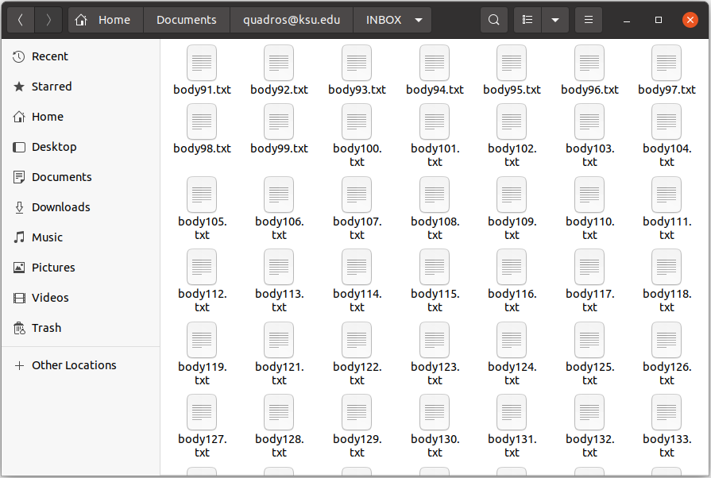
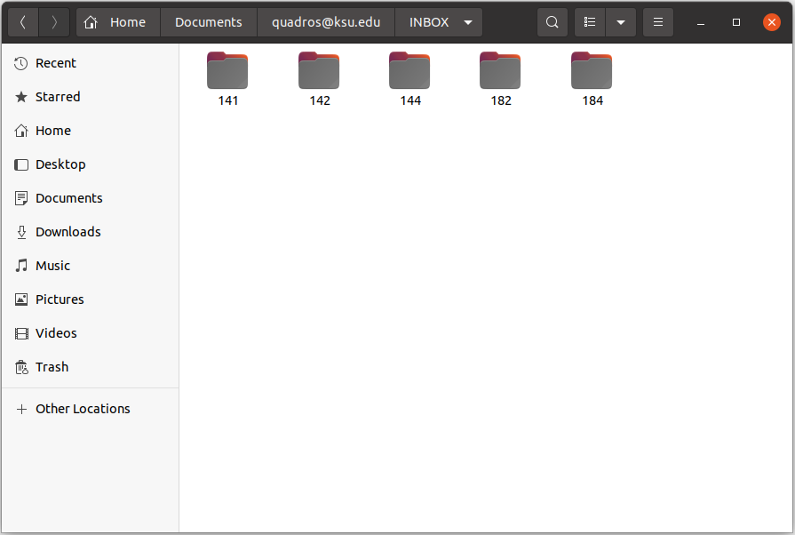
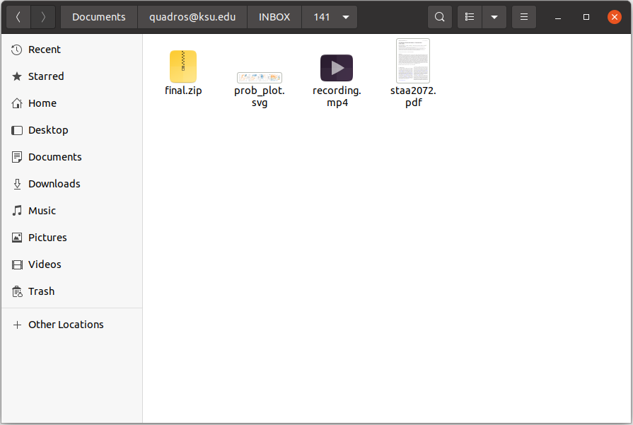

## Introduction

`mRpostman` is an easy-to-use IMAP client that provides tools for message searching, selective fetching of message attributes, mailbox management, attachment extraction, and several other IMAP features, paving the way for email data analysis in R. To do so, this package makes extensive use of the {curl} package and the libcurl C library.

In this vignette, we present all available methods and functions of this package, but not all the possibilities one can explore.

**IMPORTANT**: 

1. In version `0.9.0.0`, `mRpostman` went trough substantial changes, including ones that have no backward compatibility with versions `<= 0.3.1`. A detailed vignette on how to migrate your mRpostman's deprecated code to the new syntax is available at [_"Migrating old code to the new mRpostman's syntax"_](https://allanvc.github.io/mRpostman/articles/code_migration.html).

2. Old versions of the libcurl C library ({curl}'s main engine) will cause malfunctioning of this package. If your libcurl's version is above 7.58.0, you should be fine. If you intend to use OAuth 2.0 authentication, then you will need libcurl >= 7.65.0. To know more about the OAuth 2.0 authentication in this package, refer to the [_"Using IMAP OAuth2.0 authentication in mRpostman"_](https://allanvc.github.io/mRpostman/articles/xoauth2.0.html) vignette.

3. Most mail providers discontinued less secure apps access. If it is still available and you are comfortable with this type of access you can enable this option for your account on your mail provider. Some providers, such as Yahoo Mail, also offer the option to generate password to be used by third-party apps such as mRpostman. The other option, as mentioned above, is to set up OAuth2 (two-factor authentication) in order to access your mailbox. Please also refer to the [_"Using IMAP OAuth2.0 authentication in mRpostman"_](https://allanvc.github.io/mRpostman/articles/xoauth2.0.html) vignette.


## Providers and their IMAP urls

| **Provider**                         | **IMAP Server**           |
|--------------------------------------|---------------------------|
| Gmail                                | `imap.gmail.com`          |
| Office 365                           | `outlook.office365.com`*  |
| Outlook.com  (Hotmail and Live.com)  | `imap-mail.outlook.com`   |
| Yahoo Mail                           | `imap.mail.yahoo.com`     |
| iCloud Mail                          | `imap.mail.me.com`        |
| AOL Mail                             | `imap.aol.com`            |
| Zoho Mail                            | `imap.zoho.com`           |
| Yandex Mail                          | `imap.yandex.com`         |
| GMX Mail                             | `imap.gmx.com`            |
| Mail.com                             | `imap.mail.com`           |
| FastMail                             | `imap.fastmail.com`       |


\* For Office 365 accounts, the `username` should be set as `user@yourcompany.com` or `user@youruniversity.edu` for example.

## Package Structure

The package is now implemented under a OO framework, using an R6 class. The main functionalities of `mRpostman` are implemented as methods of the R6 class called `ImapCon`. There are also a few independent functions. All methods and functions are described below:


* **configuration methods**: `configure_imap()`, `reset_url()`, `reset_username()`, `reset_password()`, `reset_verbose()`, `reset_buffersize()`, `reset_timeout_ms()`, `reset_xoauth2_bearer()`;
* **server-capabilities method**: `list_server_capabilities()`; 
* **mailbox-operations methods**: `list_mail_folders()`, `select_folder()`, `examine_folder()`,
`rename_folder()`, `create_folder()`, `list_flags()`;
* **single-search methods**: `search_before()`, `search_since()`, `search_period()`, `search_on()`, 
`search_sent_before()`,`search_sent_since()`, `search_sent_period()`, `search_sent_on()`,
`search_string()`, `search_flag()`, `search_smaller_than()`, `search_larger_than()`,
`search_younger_than()`, `search_older_than()`;
* **the custom-search method and its helper functions**: `search()`;
  + relational operators functions: `AND()`, `OR()`;
  + criteria definition functions: `before()`, `since()`, `on()`, `sent_before()`,
  `sent_since()`, `sent_on()`, `string()`, `flag()`, `smaller_than()`, 
  `larger_than()`, `younger_than()`, `older_than()`;
* **fetch methods**: `fetch_body()`, `fetch_header()`, `fetch_text()`, 
`fetch_metadata()`, `fetch_attachments_list()`, `fetch_attachments()`;
* **attachments methods**: `list_attachments()`, `get_attachments()`, `fetch_attachments_list()`, `fetch_attachments()`;
* **complementary methods**: `copy_msg()`, `move_msg()`, `esearch_min_id()`, `esearch_max_id()`, `esearch_count_msg()`, `delete_msg()`, `expunge()`, `add_flags()`, `remove_flags()`, `replace_flags()`.


## 1) How do I start? (Connection configuration)

After setting the authentication method in your mail provider, you have to configure an IMAP connection:

```{r, message = FALSE, eval=FALSE}

library(mRpostman)

# IMAP settings

# Outlook - Office 365
con <- configure_imap(
  url="imaps://outlook.office365.com",
  username="user@your_company.com",
  password=rstudioapi::askForPassword()
  )

# Gmail
con <- configure_imap(
  url = "imaps://imap.gmail.com",
  username = "user",
  password = rstudioapi::askForPassword()
  )

# Hotmail
con <- configure_imap(
  url = "imaps://imap-mail.outlook.com",
  username = "user@hotmail.com",
  password = rstudioapi::askForPassword()
  )

# Yahoo Mail
con <- configure_imap(
  url="imaps://imap.mail.yahoo.com/",
  username="your_user",
  password=rstudioapi::askForPassword()
  )

# AOL Mail
con <- configure_imap(
  url="imaps://export.imap.aol.com/",
  username="your_user",
  password=rstudioapi::askForPassword()
  )

# Yandex Mail
con <- configure_imap(
  url="imaps://imap.yandex.com",
  username="your_user",
  password=rstudioapi::askForPassword()
  )

# ... and any other mail provider with IMAP support

```

Other useful options are: `timeout_ms`, `verbose = TRUE`, `buffersize`. Further {curl} options related to IMAP functionalities can be passed to `configure_imap()`, but you probably won't need it. See `curl::curl_options()`.

Since version `0.9.0.0`, this package provides more flexibility to the user in the sense that you can modify the connection parameters for specific commands or parts of a script, using the `reset_*()` methods. This prevents users from having to call `configure_imap()` multiple times during a session or in a script. It is particularly useful when the user is going to perform some fetch operation, for example. In this case, it is recommended to increase the `timeout_ms` and set `verbose = FALSE`.

The `con` object that we created in the example above has the `ImapCon` R6 class. Now, almost 99\% of the other IMAP commands to be performed on the server will be called following the structure: `con$method()`. The exceptions are the `list_attachments()` function and the helper functions of the custom-search group.

As you will see, the R6 framework combined with {curl} will make this package works such a session-based IMAP client. Besides this, for some commands, users will be able to use the tidy approach with pipes. All this together provides an elegant way of accessing your IMAP provider, searching and fetching emails, and managing your mailbox as well.

## 2) Server capabilities

Once the connection is configured, it is important to know which capabilities your IMAP provider offers to users. This impacts on which type of operations you are allowed to perform. For example, if your server has the `WITHIN` extension you can use the WITHIN search methods `search_younger_than()` and `search_older_than()`; if the server has the `ESEARCH` capability, besides being allowed to use the `esearch_*()` methods, you can optimize all your search functions with the `esearch = TRUE` parameter; if you see the `MOVE` capability, then you can use the `move_msg()` method. Therefore, to know all your server capabilities, you can use `list_server_capabliltites`.

```{r, message = FALSE, eval=FALSE}
con$list_server_capabilities()
```


## 3) Mailbox commands

### 3.1) Listing folders

```{r, message = FALSE, eval=FALSE}
con$list_mail_folders()
```

### 3.2) Creating a new folder

```{r, message = FALSE, eval=FALSE}
con$create_folder(name = "New Folder")
```

Except for `examine_folder()` and `rename_folder()`, from now on, you will have to select a folder to issue further commands.

### 3.3) Selecting a folder

```{r, message = FALSE, eval = FALSE}
con$select_folder(name = "INBOX")
```

Probably, the main folder in your mailbox will be the `"INBOX"`. You can select it without having to worry about the case of the letters. However, all the other folders in a mailbox are case sensitive.

### 3.4) Examining a folder

Count the number of existent and recent messages in the previously selected folder.

```{r, message = FALSE, eval=FALSE}
con$select_folder(name = "Inbox")

con$examine_folder()

```


If you want to examine a folder that is not the currently selected one (`INBOX`), you can achieve this by specifying the name.

```{r, message = FALSE, eval=FALSE}

con$examine_folder(name = "Sent")

```

### 3.5) Renaming a folder

The following will rename the selected folder.

```{r, message = FALSE, eval=FALSE}

con$select_folder(name = "CRAN Messages")

con$rename_folder(new_name = "CRAN")

```

There is a `reselect` argument, which by default is set to `TRUE`. This will cause the automatic re-selection of the new folder name.

If you want to rename a folder that is different from the currently selected one (`CRAN`), you can achieve this by specifying the name.

```{r, message = FALSE, eval=FALSE}

con$rename_folder(name = "Sent", new_name = "Sent2")

```


### 3.6) Flags listing

Flags work like tags or labels attached to messages. After a mail folder is selected, you can check which flags are available, and if you are allowed to set custom flags of your own in this folder with `list_flags()`.


```{r, message = FALSE, eval=FALSE}
con$list_flags()
```


## 4) Single-search

All search methods will return a numeric vector containing the results from the search. This allows users to chain fetch operations together with search one. You can also **NEGATE** all search expressions by setting `negate = TRUE`.

If your server supports **ESEARCH**, we recommend you to use it. It will prevent your results from being
truncated when there are too many messages ids and you didn't set a high `buffersize` in `confiure_imap()`^[This is a known bug of the libcurl library. Please, refer to this [LINK](https://curl.se/docs/knownbugs.html#IMAP_SEARCH_ALL_truncated_respon)]. With "ESEARCH", the results will be condensed to groups of sequences similar to what \R does. For instance, if your search returns 10000 results, it is better to have condensed groups such as `1:10, 12, 23:27, ...` instead of a sequence of `1, 2, 3, 4, 5, 6, ..., 10, 12, 23, 24, 25, ...`.   If you can't use ESEARCH, or if your results are being truncated even with ESEARCH, you can try to increase your buffersize in `configure_imap()` to avoid this.


### 4.1) Search by date

`search_before()`, `search_since()`, `search_on()`, and `search_period()` use internal date, which reflects the moment when the message was received. `search_sent_before()`, `search_sent_since()`, `search_sent_on()`, and
`search_sent_period()` use the RFC-2822 date header (origination date), which "specifies the date and time at which the creator of the message indicated that the message was complete and ready to enter the mail
delivery system" (Resnick, 2008). Dates in both methods must be the same most of the time. The difference may occur when you copied or moved some messages between folders. In this case, the RFC-2822 date header of the copied/moved messages in the destination folder will point out to the date of the copy.  Another difference is that searching by the internal date will probably be faster because this information is kept in a database outside the message.

#### 4.1.1) By internal date

#### 4.1.1.1) Before a date

```{r, message = FALSE, eval=FALSE}
con$select_folder(name = "INBOX")

res <- con$search_before(date_char = "07-Sep-2020")

res
```

You can use the "UID" (unique identifier) instead of the message sequence number ^[A message sequence number is a message's relative position to the oldest message in a mail folder. It may change after deleting or moving messages. If a message is deleted, sequence numbers are reordered to fill the gap. If `use_uid = TRUE`, the command will be performed using the "UID" or unique identifier, and results are presented as such. UIDs are always the same during the life cycle of a message in a mail folder.], and one or more flags as an additional filter to your search. In fact, you can use this in almost every search method of this package.

```{r, message = FALSE, eval=FALSE}

res <- con$search_before(date_char = "07-Sep-2020",
                         use_uid = TRUE,
                         flag = c("ANSWERED", "SEEN"))

res
```

Remember that, if your IMAP server has the ESEARCH capability, you can use it. Gmail is one of the mail providers that allow it.

```{r, message = FALSE, eval=FALSE}
res <- con$search_before(date_char = "07-Sep-2020",
                         use_uid = TRUE,
                         flag = c("ANSWERED", "SEEN"),
                         esearch = TRUE)

res
```

You can also **NEGATE** the statement to search for messages **NOT BEFORE a date**, for example:

```{r, message = FALSE, eval=FALSE}

res <- con$search_before(date_char = "07-Sep-2020",
                         negate = TRUE,
                         use_uid = TRUE)
                         
res
```

#### 4.1.1.2) Since a date

The previous operation, in which we have used `negate = TRUE`, is equivalent to search for messages received **SINCE a DATE**:

```{r, message = FALSE, eval = FALSE}

res <- con$search_since(date_char = "07-Sep-2020",
                        use_uid = TRUE)
                         
res
```

#### 4.1.1.3) By period

```{r, message = FALSE, eval = FALSE}

res <- con$search_period(since_date_char = "02-Jan-2020",
                         before_date_char = "30-Jun-2020")
                         
res
```

You can **NEGATE** a period search as well. In this case, the search will exclude messages from the specified period.

```{r, message = FALSE, eval = FALSE}
res <- con$search_period(since_date_char = "02-Jan-2020",
                         before_date_char = "30-Jun-2020",
                         negate = TRUE)
                         
res
```

#### 4.1.1.4) On a specific date

```{r, message = FALSE, eval = FALSE}
con$search_on(date_char = "02-Jan-2020")
                         
```


#### 4.1.2) By origination date

#### 4.1.2.1) Sent before a date

```{r, message = FALSE, eval = FALSE}
con$search_sent_before(date_char = "07-Sep-2020")

```

You can modify some of the search parameters as well:

```{r, message = FALSE, eval = FALSE}
res <- con$search_sent_before(date_char = "07-Sep-2020",
                              negate = TRUE,
                              use_uid = TRUE,
                              flag = c("ANSWERED", "SEEN"))

res

```


#### 4.1.2.2) Sent since a date

```{r, message = FALSE, eval = FALSE}
con$search_sent_since(date_char = "07-Sep-2020")
```

#### 4.1.2.3) Sent by period

```{r, message = FALSE, eval = FALSE}
con$search_sent_period(since_date_char = "02-Jan-2020",
                       before_date_char = "30-Jun-2020")

```


#### 4.1.2.4) Sent On a specific date

```{r, message = FALSE, eval = FALSE}
con$search_sent_on(date_char = "30-Jun-2020")
                         
```

### 4.2) Search by string

You can search for a simple string or compound expression either in the whole message, in a section, or in a specific header field. One important thing to know is that the SEARCH command in the IMAP server is not case sensitive. 

You can also **NEGATE** the statement and search for messages (or a specific part of a message) not containing that string, and add additional flag filters as well. 

For the next examples, we are going to select a different mail folder.

Searching in the "TO" header field:

```{r, message = FALSE, eval=FALSE}
con$select_folder(name = "K-State")

con$search_string(expr = "xpto@k-state.com", where = "TO")

```

Searching in the "FROM" header field:

```{r, message = FALSE, eval=FALSE}

con$search_string(expr = "xpto@k-state.edu", where = "FROM")

```

Searching in the "SUBJECT" header field:

```{r, message = FALSE, eval=FALSE}

con$search_string(expr = "PhD offer", where = "SUBJECT")

```

Searching in the "TEXT" section.

**IMPORTANT**: Since the text may contain raw data, it may not be a super-effective search. In this case, searching for a expression in the whole `"BODY"` may be preferred.

```{r, message = FALSE, eval=FALSE}

con$search_string(expr = "Dear Allan" where = "TEXT")

```

Searching in the "BODY" section.

```{r, message = FALSE, eval=FALSE}
con$search_string(expr = "Dear Allan" where = "BODY")

```


### 4.3) Search by flag

```{r, message = FALSE, eval = FALSE}
con$search_flag(name = c("ANSWERED", "Seen"), use_uid = TRUE)
```

Remember that you can check the available flags in a mail folder with `list_flags()`.


### 4.4) Search by size

The size is specified in bytes.

#### 4.4.1) Smaller than

```{r, message = FALSE, eval = FALSE}
con$search_smaller_than(size = 512000) # smaller than 512KB
```

#### 4.4.1) Larger than

```{r, message = FALSE, eval = FALSE}
con$search_larger_than(size = 512000) # larger than 512KB
```

### 4.5) Search by within extension

Severs with support to the "WITHIN" EXTENSION enable searching for messages within a span, i.e. younger than "x" seconds, or older than "x" seconds. This capability is really rare to find in IMAP servers, but `mRpostman` has two methods implemented for coping with this capability if it is available.

#### 4.5.1) Younger than

```{r, message = FALSE, eval = FALSE}
con$search_younger_than(seconds = 3600) # msgs received less than one hour (3600 sec)
```

#### 4.5.2) Older than

```{r, message = FALSE, eval = FALSE}
con$search_older_than(seconds = 3600) # msgs received more than one hour ago (3600 sec)
```


## 5) Custom-search

The `search()` method and its **helper functions** enable users to create a vast number of complex and customized search requests by combining different criteria, using all the types of searches previously presented in this document.

These are the helper functions you can use inside `search()`:

1) Relational operators: `AND()`, and `OR()`;
2) Criteria definition: `before()`, `since()`, `on()`, `sent_before()`, `sent_since()`, `sent_on()`, `string()`, `flag()`, `smaller_than()`, `larger_than()`, `younger_than()`, and `older_than()`.

**NOTE**: IMAP queries follows Polish notation, i.e. operators such as `OR` come before arguments, e.g. "OR argument1 argument2". Therefore, the relational operators functions in this package should be used like the following examples: `OR(before(date_char = "17-Apr-2015"), string(expr = "Jimmy", where = "FROM"))`. Even though there is no "AND" operator in the IMAP protocol, this package adds a helper function `AND()` to indicate multiple arguments that must be searched together, e.g. `AND(since(date_char = "01-Jul-2018"), larger_than(size = 16000))`.

**Example 1**: Searching for messages (in "INBOX") containing the string "Kansas State University" in the "SUBJECT" header field **AND** that were received before "02-Jan-2020".

```{r, message = FALSE, eval=FALSE}
con$select_folder(name = "INBOX")


res <- con$search(request = AND(string(expr = "Kansas State University", where = "SUBJECT"),
                                before(date_char = "02-Jan-2020")))

res
```

**Example 2**: Searching (using UID) for messages received from "@k-state.edu" **OR** "@ksu.edu".

```{r, message = FALSE, eval = FALSE}

con$search(request = OR(string(expr = "@k-state.edu", where = "FROM"),
                        string(expr = "@ksu.edu", where = "FROM")),
           use_uid = TRUE)

```

## 6) Fetch

You can fetch the full content of messages, or their parts, such as the header, text, or specific metadata fields. Besides this, you can also fetch a message attachments list or the attachment files themselves, downloading them to the disk.

We usually fetch messages after a search operation. Given the output of the search functions in **mRpostman**, you can use the pipe `%>%` to chain the search and the fetch operations together. Using the base R approach is perfectly possible as well.

In the main fetch methods (those that are not related to attachment fetching), you can choose to write the fetch results to disk (working directory) using `write_to_disk = TRUE`. If you opt to do so, **mRpostman** saves the fetched content to a `.txt` file in the following folder structure: `working directory > imap.server.url > mail folder name`. The text files will be named after the id of the fetched message. If the operation was executed using the UID, the "UID" prefix is added to the file names.

**IMPORTANT**:

1. If the fetch operation is to be chained after a search, the `use_uid` arguments in the two operations have to be the same. Otherwise, an error will occur or the fetch will be performed on wrong messages' ids.

2. It is always recommended to increase the timeout_ms before `fetch_body()`, `fetch_text()`, and `fetch_attachents()` operations as sometimes the operation may hang for a few seconds while fetching the message parts.

3. if you have configured a connection with `verbose = TRUE`, it is extremely recommended that you reset it to `FALSE` before a fetching operation. The `verbose = TRUE` option fill the console with the whole flux of information between the server and the client, drastically slowing the speed of the process and your R session.

### 6.1) Fetch body

```{r, message = FALSE, eval = FALSE}

# increasing timeout_ms
con$reset_timeout_ms(x = 30000) # ... to 30 secs

# and supposing that you had verbose = TRUE before
con$reset_verbose(x = FALSE)

# tidy approach
con$search_string(expr = "@k-state.edu", where = "FROM") %>%
  con$fetch_body(write_to_disk = TRUE, keep_in_mem = FALSE)

# ---------------

# base R approach
res <- con$search_string(expr = "@k-state.edu", where = "FROM")

con$fetch_body(msg_id = res, write_to_disk = TRUE, keep_in_mem = FALSE)
```

Since the goal here is to write the fetch results to disk, it is recommended that we set `keep_in_mem = FALSE`. This will optimize the whole operation because `mRpostman` will clean the memory after fetching each message as we are not going to use the results in our R session. 

Our local folder will be populated with the `.txt` files of the fetched messages:

{width=80%}

### 6.2) Fetch header

```{r, message = FALSE, eval=FALSE}

# tidy approach
out <- con$search_since(date_char = "15-Aug-2019", use_uid = TRUE) %>%
  con$fetch_header(use_uid = TRUE, fields = c("DATE", "SUBJECT"))

out

# ---------------

# base R approach
res <- con$search_since(date_char = "15-Aug-2019", use_uid = TRUE)

out <- con$fetch_header(use_uid = TRUE, fields = c("DATE", "SUBJECT"))

out
```

Please, note that, in the example above, we are saving the results to the `out` object in our R session. Also note that we are setting `use_uid = TRUE` in both search and fetch requests.


### 6.3) Fetch text

`fetch_text()` is almost as costly as `fetch_body()`. So, it is a good idea to keep a "high" `timeout_ms`.

```{r, message = FALSE, eval = FALSE}
con$search_since(date_char = "15-Aug-2019") %>%
  con$fetch_text(write_to_disk = TRUE, keep_in_mem = FALSE)
```

### 6.4) Fetch metadata

```{r, message = FALSE, eval = FALSE}
out <- con$search_on(date_char = "15-Aug-2019", use_uid = TRUE) %>%
  con$fetch_metadata(use_uid = TRUE, attribute = c("INTERNALDATE", "UID", "ENVELOPE"))
```

If nothing is specified to the `metadata` argument, all the metadata fields are fetched by default. To know which are the metadata options of a message, refer to `metadata_options()`.

There are two more fetch methods, but they are going to be presented in the next session since they are related to a very special fetch operation.


## 7) Attachments

Previously, `mRpostman` had two attachment-related functions: `list_attachments()` and `get_attachments()`. Both were to be used after a fetching operation because they would use the content fetched in a previous step to parse the attachments list and/or decode the content to files. These methods are still available in the current version of the package. However, two more methods were implemented since version `0.9.0.0`: `fetch_attachments_list()` and `fetch_attachments()`. These methods are not contingent on a previous fetch operation, since they are a properly fetch operation.

Let's take a look at the first two attachments functionalities available in `mRpostman`.

### 7.1) Dependent attachment operations

The dependent operations are comprised of a function `list_atachments()` and a R6 method `get_attachments()`. We call them dependent operations because they dependent on a previous fetch operation with `fetch_body()` or `fetch_text()`.

**IMPORTANT:** Since these are fetch-dependent operations, you **cannot** set `keep_in_mem = FALSE` in the `fetch_body()`/`fetch_text()` step if you intend to list or get attachments after fetching your messages.

#### 7.1.1) Listing attachments

This will list your attachments file names for each fetched message.

```{r, message = FALSE, eval = FALSE}

# using fetch_body()
con$search_since(date_char = "23-Sep-2019") %>%
  con$fetch_body(write_to_disk = TRUE) %>%
  list_attachments() # don't need to specify the connection object here

# ------------------

# using fetch_text()
con$search_since(date_char = "23-Sep-2019") %>%
  con$fetch_text(write_to_disk = TRUE) %>%
  list_attachments() # don't need to specify the connection object here
```

In both examples, the whole message body(ies) or text will be saved to the disk, but a copy will be kept in the R session. This copy is passed forward to `list_attachments()`, which, by its turn, finds and extract the filenames and the type of the "Content-Disposition" for the part where the attachment were found.

#### 7.1.2) Extracting Attachments

`get_attachments()` will try to decode base64 text inside your message to the appropriate file extension. This will create a folder with the inside the structure `working directory > username > mail folder > msg_id`. The attachment(s) will be inside their respective message folder.


```{r, message = FALSE, eval = FALSE}
# using fetch_body()
con$search_since(date_char = "23-Sep-2019") %>%
  con$fetch_body(write_to_disk = TRUE) %>%
  con$get_attachments()

# ------------------

# using fetch_text()
con$search_since(date_char = "23-Sep-2019") %>%
  con$fetch_text(write_to_disk = TRUE) %>%
  con$get_attachments()
```

The results in your local folder will be like this:

{width=80%}
{width=80%}

### 7.2) Direct attachment fetch operations

As we stated before, the following two methods are not contingent on a previous fetch step because they execute they own fetching operation. Hence, they consist of an alternative for attachments listing and downloading.

**IMPORTANT**: The same recommendations for the other fetch methods hold in this case: set `verbose = FALSE` and a high `timeout_ms`.

#### 7.2.1) Fetch attachments list

```{r, message = FALSE, eval = FALSE}
con$search_since(date_char = "23-Sep-2019") %>%
  con$fetch_attachments_list()
```

#### 7.2.2) Fetch attachments

```{r, message = FALSE, eval = FALSE}
con$search_since(date_char = "23-Sep-2019") %>%
  con$fetch_attachments()
```


## 8) Complementary operations

Here we present other functions to perform very useful complementary IMAP operations.

### 8.1) Copy message(s)

Copying search results from "INBOX" to "K-State" folder:

```{r, message = FALSE, eval = FALSE}
con$select_folder(name = "INBOX")

con$search_since(date_char = "10-may-2019") %>%
  con$copy_msg(to_folder = "K-State")

```

It will automatically re-select the destination folder unless the user sets `reselect = FALSE`.

### 8.2) Get minimum message id

This operation depends on the ESEARCH capability. It will retrieve the **minimum** message id containing a specific flag(s) in the selected mail folder.

```{r, message = FALSE, eval = FALSE}
con$esearch_min_id(flag = c("Answered", "Seen"))
```

### 8.3) Get maximum message id

This operation also depends on the ESEARCH capability. It will retrieve the **maximum** message id containing a specific flag(s) in the selected mail folder.

```{r, message = FALSE, eval = FALSE}
con$esearch_min_id(flag = c("Answered", "Seen"))
```

### 8.4) Count messages

This operation also depends on the ESEARCH capability. It will retrieve the **number** of messages with a specific flag(s) in the selected mail folder.

```{r, message = FALSE, eval = FALSE}
con$esearch_count(flag = c("Answered", "Seen"))
```

### 8.5) Delete message(s)

This method marks one or more messages with the "\\Deleted" system flag. Some servers automatically delete messages marked with this flag, and others require the `EXPUNGE` command to permanently delete the e-mail.

```{r, message = FALSE, eval = FALSE}
con$select_folder(name = "Trash")

con$search_before(date_char = "10-may-2012") %>%
  con$delete_msg()
```

Deleting an specific "msg_id" without a previous search:

```{r, message = FALSE, eval = FALSE}
con$delete_msg(msg_id = 66128)
```

### 8.6) Expunge

Expunges message(s) marked with the "DELETED" flag in a mailbox or a specific message using the `msg_uid` argument. Please, note that the this requires the unique id, not sequence numbers. Therefore, we set `use_uid = TRUE`

```{r, message = FALSE, eval = FALSE}

# expunge the entire mail folder
con$expunge()

# expunge selected msg UID
con$delete_msg(msg_id = 71171, use_uid = TRUE) %>%
  expunge()

```


### 8.7) Add/Remove/Replace flags

Adding, removing and replacing one or more flags to messages.

**IMPORTANT**: Differently from the search functions where the (system) flags passed as additional parameters to search methods did not contain "\\", the `add/replace/remove_flags()` methods require the double backslash when referring to system flags. You can know which are the flags of a mail folder, and if custom flags are allowed, using `list_flags()`.


#### 8.7.1) Add flags

```{r, message = FALSE, eval = FALSE}
con$select_folder(name = "INBOX")

con$search_since(date_char = "01-Sep-2020", use_uid = TRUE) %>%
  con$add_flags(flags_to_set = "\\Answered", use_uid = TRUE)
```


#### 8.7.2) Replace flags

Replaces the existent flags by the one(s) specified in the method.

```{r, message = FALSE, eval = FALSE}
con$search_since(date_char = "01-Sep-2020", use_uid = TRUE) %>%
  con$replace_flags(flags_to_set = c("\\Seen", "\\Flagged", use_uid = TRUE)
```


#### 8.7.3) Remove flags

Now we have the `flags_to_UNset` argument.

```{r, message = FALSE, eval = FALSE}
con$search_since(date_char = "01-Sep-2020", use_uid = TRUE) %>%
  con$remobe_flags(flags_to_unset = c("\\Seen", "\\Flagged", use_uid = TRUE)
```


### 8.8) Move message(s)

`move_msg()` uses IMAP "MOVE" EXTENSION. Check if your server supports the "MOVE" capability with `list_server_capabilities()`.

```{r, message = FALSE, eval = FALSE}

con$search_on(date_char = "07-Sep-2020") %>%
  con$move_msg(to_folder = "K-State")

```

If your server does not provide "MOVE" capability, the same result can be achieved with a combination of `copy_msg`, `add_flags()` and `expunge()`:

```{r, message = FALSE, eval = FALSE}

con$search_on(date_char = "07-Sep-2020") %>%
  con$copy_msg(to_folder = "K-State", reselect = FALSE) %>%
  con$add_flags(flags_to_set = "\\Deleted") %>%
  con$expunge()

```


## References

Babcock, N. (2016), _Introduction to IMAP_, Blog, May 2016, [http](https://nbsoftsolutions.com/blog/introduction-to-imap).

Crispin, M. (2003), _INTERNET MESSAGE ACCESS PROTOCOL - VERSION 4rev1_, RFC 3501, March 2003, [http](https://www.rfc-editor.org/rfc/rfc3501).

Freed, N. and Borenstein, N. (1996), _Multipurpose Internet Mail Extensions (MIME) Part Two: Media Types_, RFC 2046, November 1996, [http](https://www.rfc-editor.org/rfc/rfc2046).

Gungor, A. (2018), _Using IMAP Internal Date for Forensic Email Authentication_, Articles, Forensic Focus, [http](https://www.forensicfocus.com/articles/using-imap-internal-date-for-forensic-email-authentication/).

Heinlein, P. and Hartleben, P. (2008). _The Book of IMAP: Building a Mail Server with Courier and Cyrus_. No Starch Press. ISBN 978-1-59327-177-0.

Resnick, P. (2001), _Internet Message Format_, RFC 2822, April 2001, [http](https://www.rfc-editor.org/rfc/rfc2822).

Resnick, P. (2008), _Internet Message Format_, RFC 5322, October 2008, [http](https://www.rfc-editor.org/rfc/rfc5322).

Ooms, J. (2020), _curl: A Modern and Flexible Web Client for R_. R package version 4.3, [http](https://CRAN.R-project.org/package=curl).

Stenberg, D. _Libcurl - The Multiprotocol File Transfer Library_, [http](https://curl.se/libcurl/)
