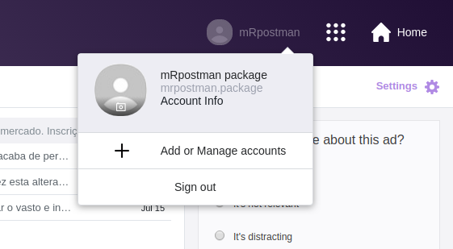
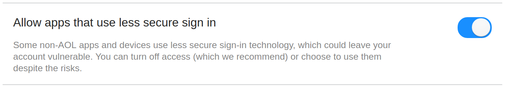

<!-- This document must be rendered in RStudio using the option "knitr with parameters" or rmarkdown::render("MyDocument.Rmd", params = list(password = "my_password")) if we want to see the results-->

## Introduction

The goal of **mRpostman** is to make it easy to connect to your IMAP 
(Internet Message Access Protocol) server and execute commands,
such as list mailboxes, search for and fetch messages in a tidy way.

In this vignette we will present all available functions of this package,
but not all the possiilities one can explore.

## First things first - Allowing Less Secure Apps Access

Before using **mRpostman**, it is essential to configure your mail account. Many 
mail providers today require authorizing **"less secure apps"** to access
your account from a third part app.

See how to do it for Gmail, Yahoo Mail and AOL Mail.


### Gmail

1) Go to Gmail website and log in with your credentials.

2) Then, go to https://myaccount.google.com/u/1/lesssecureapps?pageId=none


3) Set "Allow less secure apps" to **ON**.


### Yahoo Mail

1) Go to Yahoo Mail website and log in with your credentials.

2) Click on "Account Info".



3) Click on "Account Security" on the left menu. 


4) After, set "Allow apps that use less secure sign in" **ON**


### AOL Mail

1) Go to AOL Mail website and log in with your credentials.

2) Click on "Options" and then on "Account Info".


3) Click on "Account Security" on the left menu. 


4) After, set "Allow apps that use less secure sign in" **ON**




## Package Structure

The package is divided in 7 groups of functions:

* **configuration**: `configure_imap()`;
* **mailboxes commands**: `list_mailboxes()`, `select_mailbox()`, `examine_mailbox()`,
`rename_mailbox();`
* **options listing**: `list_server_capabilities()`,`flag_options()`, 
`section_or_field_options()`, `metadata_options()`;
* **search**: `search_before()`, `search_since()`, `search_period()`, `search_on()`, 
`search_sent_before()`,`search_sent_since()`, `search_sent_period()`, `search_sent_on()`,
`search_string()`, `search_flag()`, `search_smaller_than()`, `search_larger_than()`,
`search_younger_than()`, `search_older_than()`, `custom_search()`;
* **custom search helper functions**: 
  + relational operators functions: `AND()`, `OR()`;
  + criteria definition functions: `before()`, `since()`, `on()`, `sent_before()`,
  `sent_since()`, `sent_on()`, `string()`, `flag()`, `smaller_than()`, 
  `larger_than()`, `younger_than()`, `older_than()`;
* **fetch**: `fetch_full_msg()`, `fetch_msg_header()`, `fetch_msg_text()`, 
`fetch_msg_metadata()`;
* **miscellania**: `copy_msg()`, `get_min_id()`, `get_max_id()`, `delete_msg()`, 
`expunge()`, `add_flags()`, `remove_flags()`, `replace_flags()`, `move_msg()`.

## How do I start?

## 1) Configuration

After enabling (if needed) "Non secure apps access" in your Mail provider,
you have to configure your IMAP settings:

```{r, message = FALSE, eval=FALSE}

library(mRpostman)

# IMAP settings
# Gmail
imapconf <- configure_imap(url="imaps://imap.gmail.com",
                          username="your_user",
                          password=rstudioapi::askForPassword(),
                          verbose = TRUE
                          )

# Yahoo Mail
# imapconf <- configure_imap(url="imaps://export.imap.aol.com/",
#                           username="your_user",
#                           password=rstudioapi::askForPassword()
#                           )

# AOL Mail
# imapconf <- configure_imap(url="imaps://export.imap.aol.com/",
#                           username="your_user",
#                           password=rstudioapi::askForPassword()
#                           )

# you can try another IMAP server

```

## 2) Mailbox Commands

### 2.1) Listing Mailboxes

```{r, message = FALSE, eval=FALSE}
# Listing
imapconf %>%
  list_mailboxes()
```

From now on, you will have to select a mailbox to issue further commands.

### 2.2) Selecting a Mailbox

```{r, message = FALSE, eval = FALSE}
imapconf %>%
  select_mailbox(mbox = "INBOX") # be careful - case sensitive
```

### 2.3) Examining a Mailbox

Select a mailbox and count the number of existent and recent messages.

```{r, message = FALSE, eval=FALSE}
imapconf %>%
  select_mailbox(mbox = "UC Riverside") %>% # be careful - case sensitive
  examine_mailbox()
```

### 2.4) Renaming a Mailbox

```{r, message = FALSE, eval=FALSE}
imapconf %>%
  select_mailbox(mbox = "CRAN messages") %>% # be careful - case sensitive
  rename_mailbox(new_name = "CRAN messages2") %>%
  list_mailboxes() # and list again to check

```


## 3) Options Listing

Before executing search and fetch commands, it is recommended to check which are your options regarding to flags, message's section and fields, and you server capabilities
as well.

### 3.1) Server capabilities

Knowing you server capabilities is important when searching because you can
execute an optimized search using "ESEARCH" extension. Also, if your server has the
"WITHIN" extension, you can use `search_younger_than()` and `search_older_than()` functions.

If your server provides "MOVE" capabilities, you can use `move_msg()` for moving
messages between two mailboxes.

Note that Gmail does not provide the "WITHIN" extension.

```{r, message = FALSE, eval=FALSE}
imapconf %>%
  list_server_capabilities()
```

### 3.2) Flag Options

Flags work like tags attached to messages. You can check the options with:

```{r, message = FALSE, eval=FALSE}
flag_options()
```

### 3.2) Section and Fields Options

To see which section and/or fields of a message you can specify in some searches or
when fetching a message, use:

```{r, message = FALSE, eval=FALSE}
section_or_field_options()
```

### 3.3) Metadata Options

You can search for a specific content in a message's metadata as well. Check your options:

```{r, message = FALSE, eval=FALSE}
metadata_options()
```


## 4) Search

All search functions will return a list with an imapconf object and a "msg_id" vector
containing the results from search. The first object will be important when 
you want to put all the commands in a chain and perform a fetch after searching for messages. In this case, you will need the IMAP configuration object (`imapconf`) and the message's ids (`msg_id`).

If you do not want to return the `imapconf` object, but only the search results, you can set `return_imapconf = FALSE` in any of the search functions.

You can also **NEGATE** all search expressions by setting `negate = TRUE`.

If your server supports **ESEARCH**, use it. It will prevent your results from being
stripped. With "ESEARCH", the results will be condensed to groups of sequence similar to what R does. For instance, if your search returns 1000 results, it is better having condensed groups such as `1:10, 12, 23:27, ...` instead of a sequence of `1, 2, 3, 4, 5, 6, ..., 10, 12, 23, 24, 25, ...`.   If you can't use ESEARCH, or if your results are being stripped even with ESEARCH, you can try to increase your buffersize in `configure_imap()` in order to avoid stripping. This is related to curl's buffersize.

### 4.1) Search by Date

`search_before()`, `search_since()`, `search_on()`, and `search_period()`
use internal date, which reflects the moment when the message was received.
`search_sent_before()`, `search_sent_since()`, `search_sent_on()`, and
`search_sent_period()` use RFC-2822 date header (origination date), which
"specifies the date and time at which the creator of the message
indicated that the message was complete and ready to enter the mail
delivery system" (Resnick, 2008). Dates in both methods must be the same
most of time. Nonetheless, using internal date for search is faster
(Babcock, 2016).

#### 4.1.1) By internal date

#### 4.1.1.1) Before a date

```{r, message = FALSE, eval=FALSE}
result <- imapconf %>%
  select_mailbox(mbox = "CRAN messages2") %>%
  search_before(date_char = "17-Apr-2019", esearch = TRUE)

result$msg_id

```

You can use UID (unique identifier) instead of MSN (message sequence number) and
a flag also.

```{r, message = FALSE, eval=FALSE}
result <- imapconf %>%
  select_mailbox(mbox = "UC Riverside") %>%
  search_before(date_char = "02-May-2019", 
               by = "UID", 
               flag = "UNANSWERED",
               esearch = TRUE)

result$msg_id
```

Remember, if you do not want to return the `imapconf` object, but only the search results, you can set `return_imapconf = FALSE` in any of the search functions.

```{r, message = FALSE, eval=FALSE}
result <- imapconf %>%
  select_mailbox(mbox = "UC Riverside") %>%
  search_before(date_char = "02-May-2019", 
               by = "UID", 
               flag = "UNANSWERED",
               esearch = TRUE, return_imapconf = FALSE)

result
```

You can also **NEGATE** the statement to search for messages **NOT BEFORE a date**:

```{r, message = FALSE, eval=FALSE}
results <- imapconf %>%
  select_mailbox(mbox = "UC Riverside") %>%
  search_before(date_char = "02-May-2019", 
               negate = TRUE, 
               by = "UID", 
               flag = "UNANSWERED",
               esearch = TRUE)

results$msg_id

```

#### 4.1.1.2) Since a date

```{r, message = FALSE, eval = FALSE}
results <- imapconf %>%
  select_mailbox(mbox = "CRAN messages2") %>%
  search_since(date_char = "17-Apr-2019",
              esearch = TRUE)

```

#### 4.1.1.3) By period

```{r, message = FALSE, eval = FALSE}
results <- imapconf %>%
  select_mailbox(mbox = "CRAN messages2") %>%
  search_period(since_date_char = "02-Jan-2019",
               before_date_char = "30-Jun-2019",
               flag = "ANSWERED",
               esearch = TRUE)

```

You can **NEGATE** period searches too:

```{r, message = FALSE, eval = FALSE}
results <- imapconf %>%
  select_mailbox(mbox = "CRAN messages2") %>%
  search_period(since_date_char = "17-Jun-2019",
               before_date_char = "30-Jun-2019", 
               negate = TRUE,
               flag = "ANSWERED",
               esearch = TRUE)

```

#### 4.1.1.4) On a specific date

```{r, message = FALSE, eval = FALSE}
results <- imapconf %>%
  select_mailbox(mbox = "CRAN messages2") %>%
  search_on(date_char = "30-Apr-2019", 
           flag = "SEEN",
           esearch = TRUE)

```


#### 4.1.2) By origination date

#### 4.1.2.1) Sent Before a date

```{r, message = FALSE, eval = FALSE}
results <- imapconf %>%
  select_mailbox(mbox = "CRAN messages2") %>%
  search_sent_before(date_char = "17-Apr-2019")

results$msg_id

```

You can use UID (unique identifier) instead of MSN (message sequence number) and
a flag also.

```{r, message = FALSE, eval = FALSE}
results <- imapconf %>%
  select_mailbox(mbox = "UC Riverside") %>%
  search_sent_before(date_char = "02-Jan-2019", 
                   by = "UID", 
                   flag = "UNANSWERED",
                   esearch = TRUE)

```

You can also **NEGATE** the statement to search for messages **NOT SENTBEFORE a date**:

```{r, message = FALSE, eval = FALSE}
results <- imapconf %>%
  select_mailbox(mbox = "UC Riverside") %>%
  search_sent_before(date_char = "02-May-2019", 
                   negate = TRUE, 
                   by = "UID", 
                   flag = "UNANSWERED",
                   esearch = TRUE)

```

#### 4.1.2.2) Sent Since a date

```{r, message = FALSE, eval = FALSE}
results <- imapconf %>%
  select_mailbox(mbox = "CRAN messages2") %>%
  search_sent_since(date_char = "17-Apr-2019")

```

#### 4.1.2.3) Sent by period

```{r, message = FALSE, eval = FALSE}
results <- imapconf %>%
  select_mailbox(mbox = "CRAN messages2") %>%
  search_sent_period(since_date_char = "17-Jun-2019",
               before_date_char = "30-Jun-2019",
               flag = "ANSWERED")

```

You can **NEGATE** period searches too:

```{r, message = FALSE, eval = FALSE}
results <- imapconf %>%
  select_mailbox(mbox = "CRAN messages2") %>%
  search_sent_period(since_date_char = "17-Jun-2019",
               before_date_char = "30-Jun-2019", negate = TRUE,
               flag = "ANSWERED")

```

#### 4.1.2.4) Sent On a specific date

```{r, message = FALSE, eval = FALSE}
results <- imapconf %>%
  select_mailbox(mbox = "CRAN messages2") %>%
  search_sent_on(date_char = "30-Apr-2019", 
               flag = "SEEN",
               esearch = TRUE)

```

### 4.2) Search by String

You can search for a simple or compound string either in the whole message, in a section, or in a specific header field. You can also **NEGATE** the statement and search for messages (or specific part of a message) not containing that string.

When searching by string, it is not possible to use flags.

Searching "TO" field:

```{r, message = FALSE, eval=FALSE}
results <- imapconf %>%
  select_mailbox(mbox = "CRAN messages2") %>%
  search_string(section_or_field = "TO", string = "hadley@rstudio.com",
               negate = TRUE) # not TO "hadley@rstudio.com"

results$msg_id

```

Searching "TEXT" section.

```{r, message = FALSE, eval=FALSE}
results <- imapconf %>%
  select_mailbox(mbox = "UC Riverside") %>%
  search_string(section_or_field = "TEXT", string = "Dear Allan")

```

To search for the string in the whole message, use `section_or_field = "BODY"`.

```{r, message = FALSE, eval=FALSE}
results <- imapconf %>%
select_mailbox(mbox = "UC Riverside") %>%
  search_string(section_or_field = "BODY", string = "Dear Allan")

```

Check `section_or_fields_options()` to see which fields and sections you can specify.


### 4.3) Search by Flag

```{r, message = FALSE, eval = FALSE}
results <- imapconf %>%
  select_mailbox(mbox = "INBOX") %>%
  search_flag(flag = "RECENT", by = "UID")

```

Check `flag_options()` to see which flags you can specify.


### 4.4) Search by Size

The size is specified in bytes.

#### 4.4.1) Smaller Than

```{r, message = FALSE, eval = FALSE}
results <- imapconf %>%
  select_mailbox(mbox = "INBOX") %>%
  search_smaller_than(size = 512000) # smaller than 512KB

```

#### 4.4.1) Larger Than

```{r, message = FALSE, eval = FALSE}
results <- imapconf %>%
  select_mailbox(mbox = "INBOX") %>%
  search_larger_than(size = 512000, esearch = TRUE) # Larger than 512KB

```

### 4.5) Search by Within Extension

Severs who support "WITHIN" EXTENSION enable searching for messages within a span
of time, i.e. younger than "x" seconds, or older than "x" seconds.

#### 4.5.1) Younger Than

```{r, message = FALSE, eval = FALSE}
results <- imapconf %>%
  select_mailbox(mbox = "INBOX") %>%
  search_younger_than(seconds = 3600) # msgs received in less than one hour (3600 sec)

```

#### 4.5.2) Older Than

```{r, message = FALSE, eval = FALSE}
results <- imapconf %>%
  select_mailbox(mbox = "INBOX") %>%
  search_older_than(seconds = 3600) # msgs received in not less than one hour (3600 sec)

```


### 4.6) Custom Search

`custom_search()` and its **helper functions** allow you to create a vast number of
customized search by combining different criteria using all the types of searches presented before.

These are the helper functions you can use inside `custom_search()`:

1) Relational operators: `AND()`, and `OR()`;
2) Criteria definition: `before()`, `since()`, `on()`, `sent_before()`,
`sent_since()`, `sent_on()`, `string()`, `flag()`, `smaller_than()`, `larger_than()`, `younger_than()`, and `older_than()`.

NOTE: IMAP queries follows Polish notation, i.e. operators such as `OR` come before arguments, e.g. "OR argument1 argument2". Therefore, the relational operators functions in this package should be used like the following examples: `OR(before("17-Apr-2015"), string("FROM", "Jim"))`. Even though there is no "AND" operator in IMAP, this package adds a helper funcion `AND()` to indicate multiples arguments that must be searched together, e.g. `AND(since("01-Jul-2018"), larger_than(16000))`.

Example 1: Searching for messages containing the string "toronto" in the "FROM" field
**AND** that were received before "12-Apr-2019".

```{r, message = FALSE, eval=FALSE}

results <- imapconf %>%
  select_mailbox(mbox = "INBOX") %>%
  custom_search(custom_request = 
                 AND(
                   string(section_or_field = "FROM", string = "Toronto"),
                   before(date_char = "12-Apr-2019")
                   )
               )

results$msg_id

```

Example 2: Searching for messages containing the string "Contract 2872827" in the
"TEXT" section **OR** the string "Buying operation" in the "Subject" field of the "HEADER".

```{r, message = FALSE, eval = FALSE}

results <- imapconf %>%
  select_mailbox(mbox = "INBOX") %>%
  custom_search(custom_request = 
                 OR(
                   string(section_or_field = "TEXT", string = "Contract 2872827"),
                   string(section_or_field = "Subject", string = "Buying operation")
                   )
               )

results$msg_id

```

## 5) Fetch

You can fetch full messages, message headers, message texts, or only metadata field(s) of messages.

We usually fetch messages after a search. Given the output of search functions in **mRpostman**, you will have to use the **exposition pipe** `%$%` in order to retrieve and correctly map the `imapconf` object and the `msg_id` (search results).

You can also choose to write fetch results to disk (working directory) using `write_to_file = TRUE`. If you choose to do so, **mRpostman** creates a folder with the mailbox name in your wd and save the parts of the messages you are fetching to text files using each message sequence number (MSN) or unique identifier (UID) as names.

### 5.1) Fetch Full Message

```{r, message = FALSE, eval = FALSE}

results <- imapconf %>%
  select_mailbox(mbox = "UC Riverside") %>%
  search_before(date_char = "10-Mar-2019", by = "UID") %$% #exposition pipe operator
  fetch_full_msg(imapconf = imapconf, msg_id = msg_id,
                 by="UID", write_to_file = TRUE, keep_in_mem = TRUE,
                 partial = "0.789")

```

Do not forget to re-specify `by = "UID"` inside `fetch_full_msg()`.

### 5.2) Fetch Message Header

```{r, message = FALSE, eval=FALSE}

results <- imapconf %>%
  select_mailbox(mbox = "UC Riverside") %>%
  search_since(date_char = "15-Aug-2019", by = "UID") %$% #exposition pipe operator
  fetch_msg_header(imapconf = imapconf, 
                   msg_id = msg_id, 
                   fields = c("DATE", "SUBJECT"),
                   by = "UID")

results

```

### 5.3) Fetch Message Text

```{r, message = FALSE, eval = FALSE}

results <- imapconf %>%
  select_mailbox(mbox = "INBOX") %>%
  search_since(date_char = "17-Aug-2019", by = "UID") %$% #exposition pipe operator
  fetch_msg_text(imapconf = imapconf, msg_id = msg_id, by = "UID", try_b64decode = TRUE)

```

### 5.4) Fetch Message Metadata

```{r, message = FALSE, eval = FALSE}

results <- imapconf %>%
  select_mailbox(mbox = "INBOX") %>%
  search_on(date_char = "10-may-2019", by = "UID") %$% #exposition pipe operator
  fetch_msg_metadata(imapconf, msg_id = msg_id, by = "UID",
                   metadata = c("INTERNALDATE", "UID", "ENVELOPE"))

```

You can check metadata options with `metadata_options()`.


## 6) Miscellanea

Here we present other functions to perform useful IMAP operations.

### 6.1) Copy Message(s)

Copying seach results form "CRAN messages2" to "INBOX" mailbox:

```{r, message = FALSE, eval = FALSE}
results <- imapconf %>%
  select_mailbox(mbox = "CRAN messages2") %>%
  search_since(date_char = "10-may-2019") %$% #exposition pipe operator
  copy_msg(imapconf = imapconf, msg_id = msg_id, to_mbox = "INBOX")

```


### 6.2) Get minimum (smaller) message ID with specific flag

```{r, message = FALSE, eval = FALSE}
results <- imapconf %>%
  select_mailbox(mbox = "[Gmail]/Trash") %>%
  get_min_id(flag = "UNSEEN")

```

### 6.3) Get maximum (larger) message ID with specific flag

```{r, message = FALSE, eval = FALSE}
results <- imapconf %>%
  select_mailbox(mbox = "[Gmail]/Trash") %>%
  get_max_id(flag = "UNSEEN")

```

### 6.4) Delete message(s)

```{r, message = FALSE, eval = FALSE}
results <- imapconf %>%
  select_mailbox(mbox = "[Gmail]/Trash") %>%
  search_before(date_char = "10-may-2012", by = "UID") %$% #exposition pipe operator
  delete_msg(imapconf = imapconf, msg_id = msg_id)

```

Deleting a specific "msg_id" without a previous search:

```{r, message = FALSE, eval = FALSE}

results <- imapconf %>%
  select_mailbox(mbox = "INBOX") %>%
  delete_msg(msg_id = 66128)

```

### 6.5) Expunge

Expunges message(s) marked with the "DELETED" flag in a mailbox or a specific message using the `specific_UID` attribute.

```{r, message = FALSE, eval = FALSE}

results <- imapconf %>%
  select_mailbox(mbox = "[Gmail]/Trash") %>%
  delete_msg(msg_id = 71171, by = "UID") %$%
  expunge(imapconf = imapconf, specific_UID = msg_id)

```


### 6.6) Add/Remove/Replace Flags

Adding, removing and replacing one or more flags to messages. 


#### 6.6.1) Add Flags

```{r, message = FALSE, eval = FALSE}

results <- imapconf %>%
  select_mailbox(mbox = "INBOX") %>%
  search_since(date_char = "18-Aug-2019", by = "UID") %$% #exposition pipe operator
  add_flags(imapconf = imapconf, msg_id = msg_id, flags_to_set = "RECENT")

```

You cannot add a flag that is the antonym of an already existent flag in the message, e.g. cannot add "UNSEEN" flag when a message already has flag "SEEN". Use `replace_flags()` instead.

#### 6.6.2) Remove Flags

```{r, message = FALSE, eval = FALSE}

results <- imapconf %>%
  select_mailbox(mbox = "INBOX") %>%
  search_since(date_char = "18-Aug-2019", by = "UID") %$% #exposition pipe operator
  remove_flags(imapconf = imapconf, msg_id = msg_id, flags_to_unset = "RECENT")

```

#### 6.6.3) Replace Flags

```{r, message = FALSE, eval = FALSE}

results <- imapconf %>%
  select_mailbox(mbox = "INBOX") %>%
  search_before(date_char = "10-may-2012", by = "UID") %$% #exposition pipe operator
  replace_flags(imapconf = imapconf, msg_id = msg_id, 
               flags_to_set = flags_to_set = c("SEEN", "DRAFT"))

```

### 6.7) Move Message(s)

`move_msg()` uses IMAP "MOVE" EXTENSION. Check if your server supports "MOVE" capability with `list_server_capabilities()`.

```{r, message = FALSE, eval = FALSE}

# copy search results from "Sent" to "INBOX"
results <- imapconf %>%
  select_mailbox(mbox = "[Gmail]/Sent Mail") %>%
  search_before(date_char = "10-may-2012") %$% #exposition pipe operator
  move_msg(imapconf = imapconf, msg_id = msg_id, to_mbox = "CRAN messages2")


```

If your server does not provide "MOVE" capability, the same result can be achieved with a combination of `add_flags()` and `expunge()`:

```{r, message = FALSE, eval = FALSE}
results <- imapconf %>%
  select_mailbox(mbox = "[Gmail]/Sent Mail") %>%
  search_before(date_char = "10-may-2012") %$% #exposition pipe operator
  copy_msg(imapconf = imapconf, msg_id = msg_id, to_mbox = "CRAN messages2") %$%
  add_flags(imapconf = imapconf, msg_id = msg_id, flags_to_set = "Deleted") %$%
  expunge()

```


```{r, message = FALSE, echo = FALSE, results = 'hide', eval=FALSE}
# returning mbox name to original

imapconf %>%
  select_mailbox(mbox = "CRAN messages2") %>% # be careful - case sensitive
  rename_mailbox(new_name = "CRAN messages")

```


## References

Babcock, N., *Introduction to IMAP*, Blog, May 2016, https://nbsoftsolutions.com/blog/introduction-to-imap.

Crispin, M., *INTERNET MESSAGE ACCESS PROTOCOL - VERSION 4rev1*, RFC 3501, 
DOI: 10.17487/RFC3501, March 2003, https://www.rfc-editor.org/info/rfc3501.

Ooms, J. *curl: A Modern and Flexible Web Client for R*. R package version 3.3, 2019, https://CRAN.R-project.org/package=curl

Stenberg, D. *Libcurl - The Multiprotocol File Transfer Library*, https://curl.haxx.se/libcurl/

Freed, N. and N. Borenstein, *Multipurpose Internet Mail Extensions (MIME) Part Two: Media Types*, RFC 2046, DOI: 10.17487/RFC2046, November 1996, https://www.rfc-editor.org/info/rfc2046.

Resnick, P., Ed., *Internet Message Format*, RFC 2822, DOI: 10.17487/RFC2822, April 2001, https://www.rfc-editor.org/info/rfc2822.

Resnick, P., Ed., *Internet Message Format*, RFC 5322, DOI: 10.17487/RFC5322, October 2008, https://www.rfc-editor.org/info/rfc5322.
