<style>
  .col2 {
    columns: 2 100px;         /* number of columns and width in pixels*/
    -webkit-columns: 2 100px; /* chrome, safari */
    -moz-columns: 2 100px;    /* firefox */
  }
  <!-- .col3 { -->
  <!--   columns: 3 100px; -->
  <!--   -webkit-columns: 3 100px; -->
  <!--   -moz-columns: 3 100px; -->
  <!-- } -->
</style>

## Introduction{#intro}

More and more mail providers are adopting the OAuth2.0 authentication as for their preferred method. Although there may be some pain involved in the process of configuring and obtaining an access token, it is a more secure way of authenticating your identity during an IMAP session.

In this vignette, we will describe the process of obtaining, using, and refreshing an OAuth2.0 token to establish a connection with the Gmail IMAP server. This process will be very likely the same when trying to replicate it in other mail providers, such as AOL, Yahoo, Outlook Office 365, and many others.

__IMPORTANT__: Currently, the only drawback with this approach may be your libcurl's version. The libcurl functionality responsible for transmitting the token was not working properly in old libcurl versions. If you have version 7.65.0 (released on May 22, 2019) or above installed, you should be fine. Therefore, we recommend checking to which libcurl version, the curl R package is linked by executing:

```{r, message = FALSE}
curl::curl_version()
```

The steps involved in configuring and obtaining an OAuth2.0 access token can be summarized as follows:

* 1) creating a new API project in the Google Account Console
* 2) creating new credentials access for the project
* 3) obtaining and saving the credentials
* 4) using the `httr` package to retrieve the token
* 5) testing the IMAP connection
* 6) refreshing the token when needed


## Step 1 - Creating a new API project

Using your web browser, log into the page: https://console.developers.google.com/apis/. Assuming that you don't have any pre-existent project, you should see this page:

<!--  -->
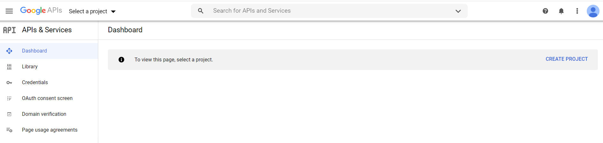{width=700px}

Then, click on "Create New Project"

On the next screen, type a name for your project. Here, we go with "xpto-allan":

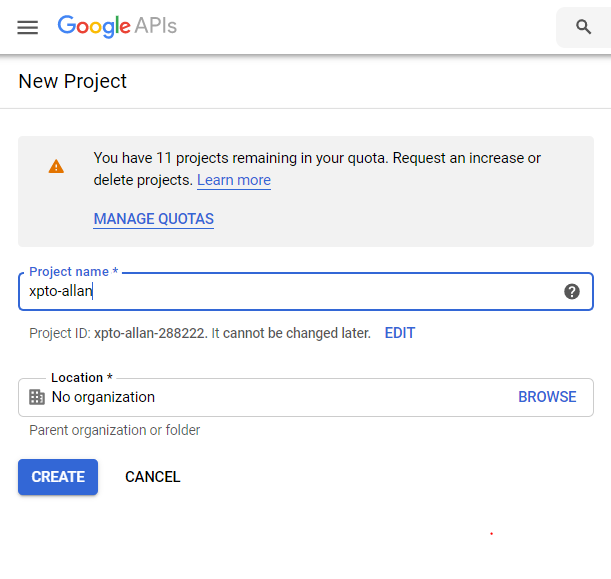{width=60%}

After a few seconds, the project is created.


## Step 2 - Creating new credentials

Once the project is created, we move to the credentials part.

Click on "CREDENTIALS" in the menu on the left:

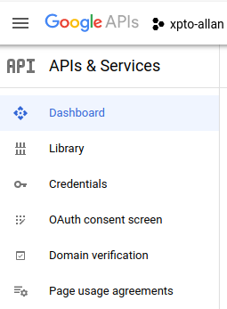{width=250px}

<br>

You should see the following screen:

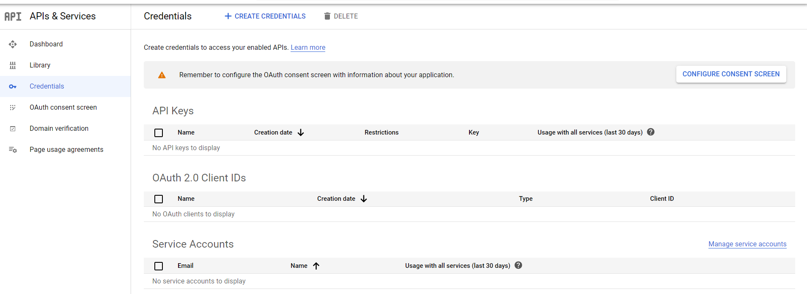{width=750px}

<br>
On the top menu, click on "+ CREATE CREDENTIALS", then on "OAuth client ID".

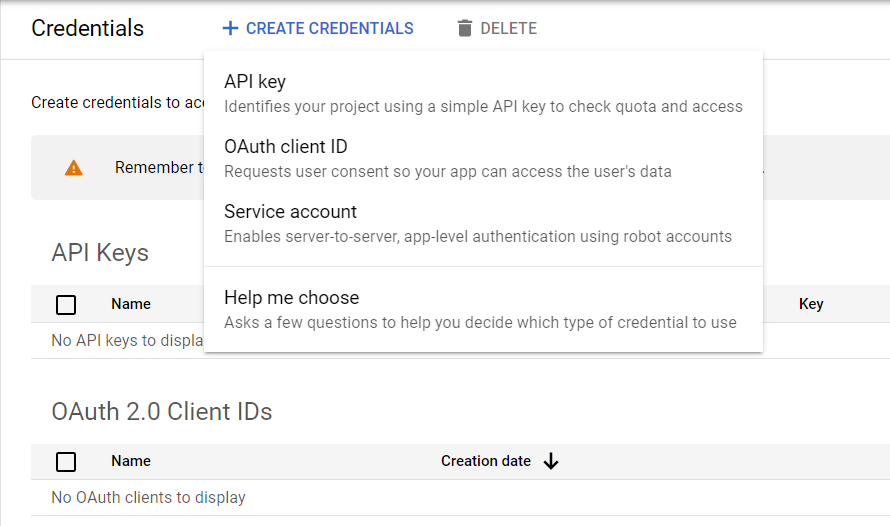{width=550px}

<br>


You should see the following screen. Select "Web Application".

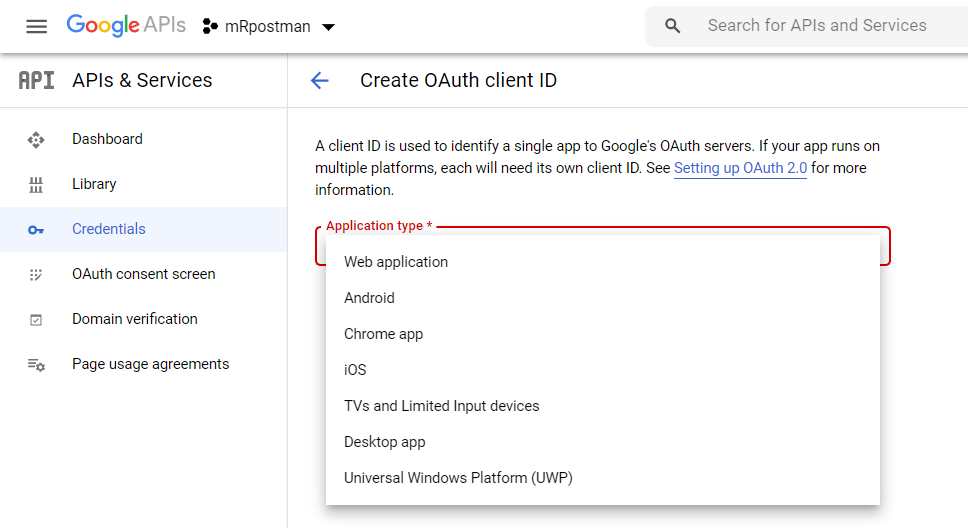{width=550px}

<br>

In the following screen, fill in the name of the OAuth2.0 client. You chose "mRpostman", but you can choose the name of your preference.

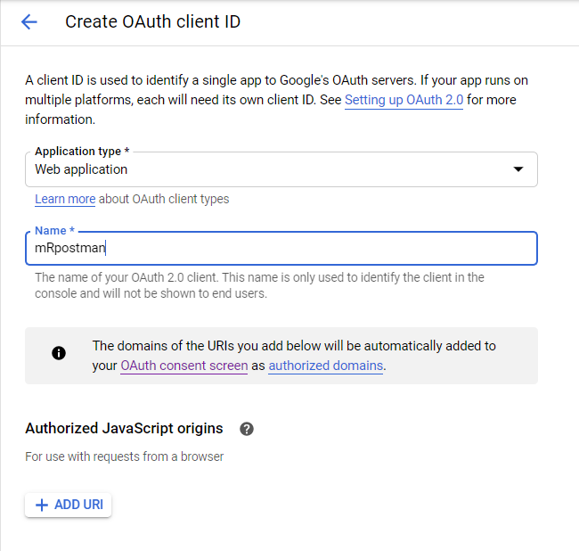{width=60%}

Scroll down the page and click "CREATE".


## Step 3 - Saving the credentials

On the following page, you have your key and client information.

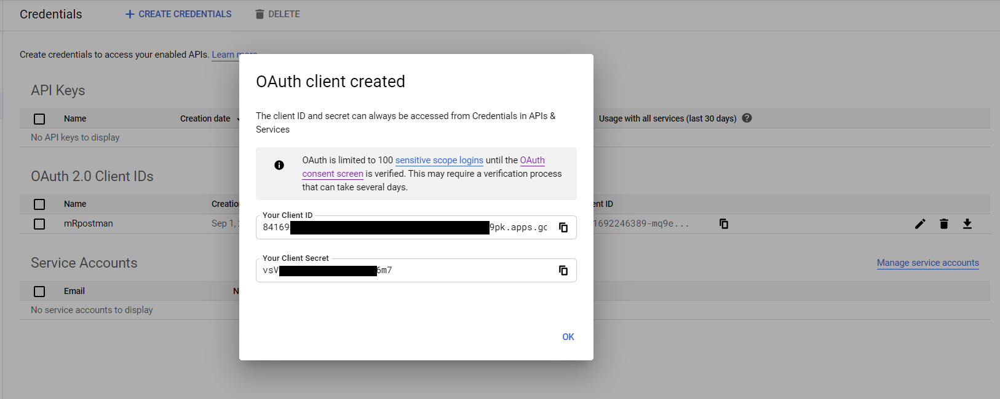{width=680px}

Copy the information above to an R script:

```{r, message = FALSE, eval=FALSE}
secret = "vsV[...]6m7"

key = "85169[...]9pk.apps.googleusercontent.com"
```

In this same script, we use the `httr` package to configure and obtain our token.

## Step 4 - Using the `httr` package to retrieve the token

Now, we need an endpoint, an app configuration, and a scope, which is circumscribed to Gmail. The `httr` package has some pre-set endpoints for Google, Yahoo, and other APIs. So, it is very straightforward to define one with `httr`.

```{r, message = FALSE, eval=FALSE}
endpoint <- httr::oauth_endpoints("google")

gmail_app <- httr::oauth_app(
  "xpto-allan",
  key = key,
  secret = secret
)

scope <- "https://mail.google.com/"

auth_code <- httr::oauth2.0_token(endpoint, app = gmail_app, scope = scope)
```

As it is the first time you are trying to access your account using the OAuth2.0 token, you'll be prompted about caching your credentials on a local file.

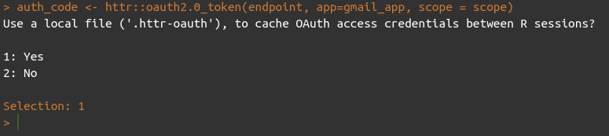{width=550px}

After, you will be redirected to a webpage, where you are going to make some confirmations about your identity:

<div class="col2">

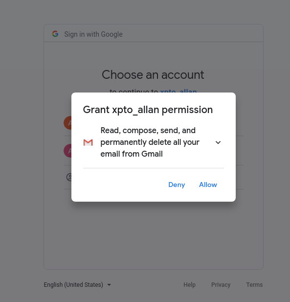{width=90%}
<br>
<br>
<br>
<br>
<br>
<br>

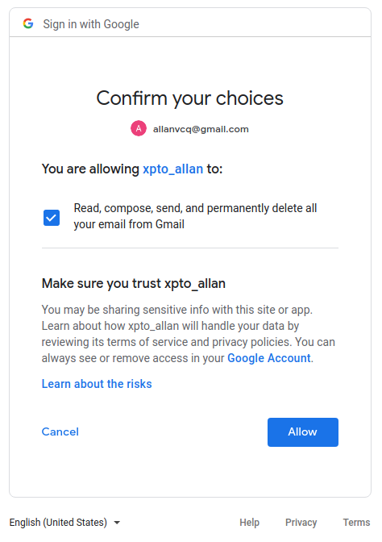{width=80%}
</div>


Finally, you should see a new white tab with the message: _"Authentication complete. Please close this page and return to R"_.

## Step 5 - Testing the IMAP connection

Now we can test our IMAP connection with `mRpostman`, using the `xoauth2_bearer` argument in `configure_imap()`:

First, we put our access token into a different object. This is not mandatory. You can pass the `auth_code$access_token` directly to the `xoauth2_bearer` argument. Your token should be a large string, starting with "ya29.<...>". If it is empty, re-execute the line `auth_code <- httr::oauth2.0_token(endpoint, app = gmail_app, scope = scope)`.

```{r, message = FALSE, eval=FALSE}
token <- auth_code$credentials$access_token

```

Finally, we configure an IMAP connection and test it:

```{r, message = FALSE, eval = FALSE}
library(mRpostman)
con <- configure_imap(url="imaps://imap.gmail.com",
                      username = "user@gmail.com",
                      use_ssl = TRUE,
                      verbose = TRUE,
                      xoauth2_bearer = token
                      )

con$list_server_capabilities()

```

```{r, message = FALSE, echo = FALSE}
c("IMAP4rev1", "UNSELECT", "IDLE", "NAMESPACE", "QUOTA", "ID", "XLIST", "CHILDREN", "X-GM-EXT-1", "UIDPLUS", "COMPRESS=DEFLATE", "ENABLE", "MOVE", "CONDSTORE", "ESEARCH", "UTF8=ACCEPT", "LIST-EXTENDED", "LIST-STATUS", "LITERAL-", "SPECIAL-USE", "APPENDLIMIT=35651584")
```

If you got some kind of "SASL ..." error in the information flow between the server and mRpostman, your libcurl version may be older than the 7.65 we mentioned in the [Introduction](#intro). Therefore, it still has the Oauth2.0 bearer bug. If this is the case you should update it. Or, perhaps your libcurl version is updated, but your curl R package is pointing to an older version of libcurl in your disk. In this case, you'll have to dig on the internet how to solve it.


## Step 6 - Refreshing the token

For future sessions (or after a considerable span of time) you'll need to refresh the previous token. You can use the following function below to achieve that:

```{r, message = FALSE, eval=FALSE}
# thanks to jdeboer code at https://github.com/r-lib/httr/issues/31
oauth2.0_refresh <- function(endpoint, app, auth_code, type = NULL) {
  req <- httr::POST(
    url = endpoint$access,
    multipart = FALSE,
    body = list(
      client_id = app$key,
      client_secret = app$secret,
      grant_type = "refresh_token",
      refresh_token = auth_code$credentials$refresh_token
    )
  )
  content_out <- httr::content(req, type = type)
  content_out <- c(content_out, auth_code$credentials$access_token)
}

auth_code_new <- oauth2.0_refresh(endpoint, app=gmail_app, auth_code=auth_code)

token <- auth_code_new$access_token
```

Substitute it into the `xoauth2_bearer` argument in `configure_imap()` and you are done.

